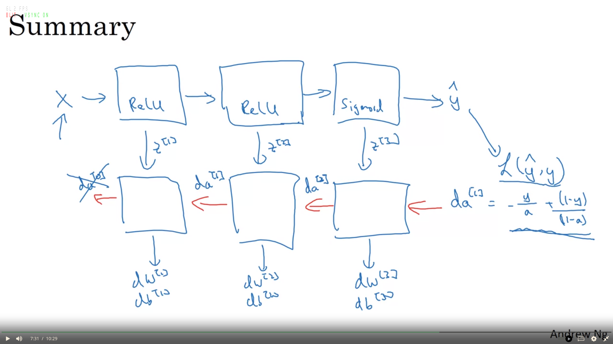

# Neural Network Terminologies

## Feedforward NN
A NN where the data traverses in only one direction during inference

## Fully Connected Layer
A layer where each neuron is connected with every other neuron in the previous layer.

## Activation Function
The activation function is a mathematical operation that is applied to the output of a neuron before it is passed on to the next neuron. The activation function determines how the neuron will respond to its inputs. It activates a neuron, based on a threshold. Some activation functions are:
 - Sigmoid function: f(z) = 1/(1+e-z)
 - Linear function : f(z) = z. (or ‘no function’).
 - ReLu (Rectified linear activation function): f(z) = max(0,z). It is preferred in hidden layers.

## Forward propogation 
As the input is passed from one layer to another, it is multiplied by the weight and added to bias. Then the whole thing is passed to an activation function before passed on to the next layer. The activation function determines if the neuron is activated for the next layer. Generally ReLu is used for hidden layer and sigmoid(or softmax) for the output layer (for classification). 
For each layer L ,if g is the activation function,

                f(X) = g( W.X + b)

So, the whole NN would look like

    fnn(X) = f1(f2(f3(X)))  
i.e, a NN is a nested function where each layer acts as a function.
This whole process where the input propogates through the different layers to the output layer to perform inference is called forward propogation.
If we want to solve a regression or a classification problem discussed in previous chapters, the last (the rightmost) layer of a neural network usually contains only one unit. If the activation function  of the last unit is linear, then the neural network is a regression model. If it is a logistic function, the neural network is a binary classification model.

## Backward propogation
Training is the process by which a neural network eats the data, and updates its parameters such that the cost function is reduced. Backpropagation is the algorithm used to compute the gradients of the loss function with respect to the model's parameters, and these gradients are subsequently used by gradient descent for parameter updates.

In neural networks, it is essential to initialize the weights and biases as random numbers, as vice versa will lead to equal gradients for all features. This lead to the no convergence, regardless of the number of epochs.

The backpropagation algorithm works as follows:
 1. **Forward pass:** The network propagates the input data forward through the network, calculating the output of neural network. The error between the network's prediction and the target is used to form a loss function, and eventually a cost function. During actual implementation, we cache w[l], b[l] and z[l] for every layer, so that they are readily available for back propogation.
 2. **Backward pass:** This partial derivative of the cost function is calculated with respect to each parameter. The negative gradient of the cost function points in the direction of steepest descent, which helps to minimize the cost function.
   
    It is implemented as:  
    ```  
    At each layer l,
        dZ[l] = dA[l] * g[l]’(Z[l]) 
        dW[l] = (1/m) dZ[l]. A[l-1]T
        db[l] = (1/m) np.sum(dZ[l], axis=1, keepdims=True)	
        dA[l-1] = W[l]T . dZ[l]
    ```


 3. Optimisation: The network's parameters are updated using the corresponding gradients. The learning rate, a hyperparameter, is multiplied by the gradient to determine the step size. This step size controls the rate at which the parameters are adjusted. One iteration of backpropagation involves updating the parameters based on the calculated gradients for the given batch of data. An epoch consists of multiple iterations, where each iteration updates the parameters using a different batch of data.
   
## Gradient Checking
It is a method for checking if gradient calculation is accurate or not. It can be used to verify if backpropogation implementation is correct or not.

## Exploding and Vanishing gradients

Exploding and vanishing gradients are issues that can occur during the training of neural networks, particularly those with many layers. These problems are related to the way gradients are propagated backward through the network during the backpropagation process. It is vastly prevalent in RNNs.

**Exploding Gradients:** When gradients grow exponentially as they are propagated backward through the layers of a deep neural network, it's referred to as the "exploding gradients" problem. As the gradients become extremely large, parameter updates can also become very large, causing the network's parameters to change significantly in each iteration. This can lead to instability in training, making it difficult for the network to converge to a good solution.

**Vanishing Gradients:** This often happens when the network has many layers, particularly in networks with activation functions that squash their inputs. As gradients become smaller and smaller, the updates to the parameters become insignificant, and the network learns at an extremely slow pace. This can lead to early layers of the network not learning effectively, resulting in poor overall performance.

One way to reduce this problem is to initialise the weights with a varience of 1/n (or 2/n). 

## Types of Neural Networks
1. Multilayer Perceptrons
2. Convolutional Neural Network
3. Recurrent Neural Networks
4. LSTM (implemented RNN)
5. GANs
6. Transformers