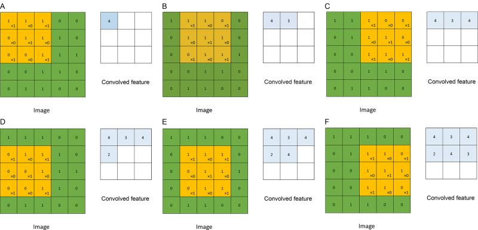
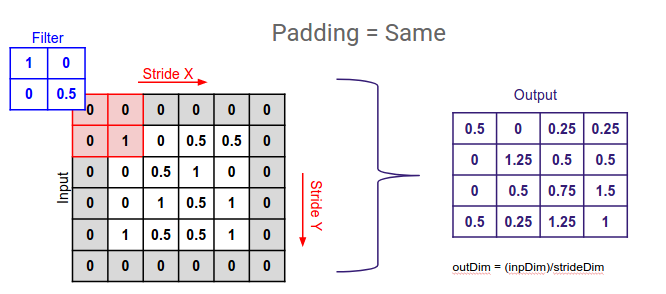
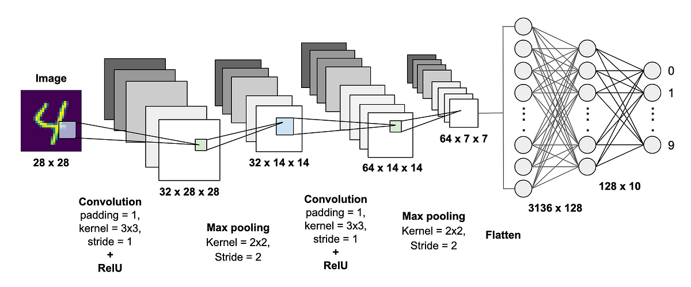
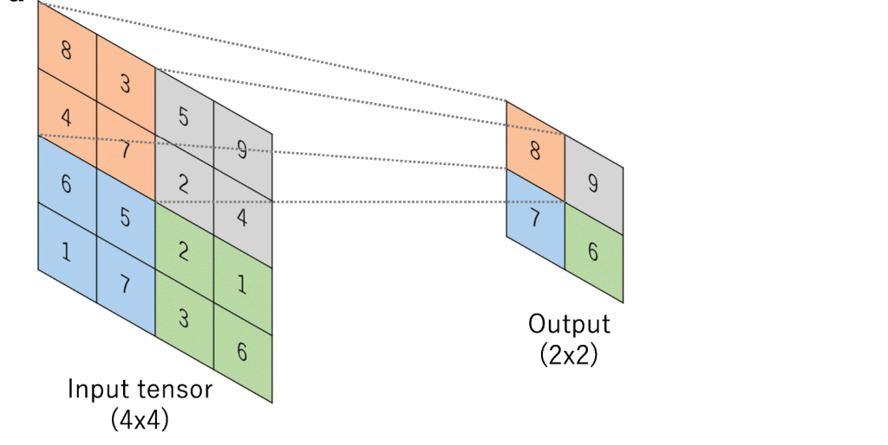

# Neural Networks for Image processing (CNNs)

Whenever we are working with image data, we end up having a lot of features. This makes the nn very hard to train and prone to overfitting, because of the sheer volume of parameters. A good way to solve this problem is by using CNNs.

# Convolution
Convolution is performed using a convolutional kernel (also called a filter), which is a small matrix that slides or "convolves" across the input data, element-wise multiplying and summing values as it goes. The result is a feature map that represents certain features or patterns in the input data. 

Convolution can be used to detect edges in an image. Therefore, we design NN, which encoporates convolution for image processing.

Different types of kernels are used to detect different edges. This image shows the idea.

In reality, we can use Sobel or Scharr filter, which perform better. **A  better idea is to treat the filter itself as a learnable parameter, and learn it via backpropogation.** This is the way convolution is implemented in CNNs.

NOTE: In mathematics, convolution is always preceded by flipping the filter. In CS, we don't do that. Thus in reality, what we are doing is called 'cross-correlation'.

## Padding
Padding allows getting a larger output matrix, after covolution is performed. The cells added by padding usually contain zeroes.

## Stride 
We step the convolution of the matrix by the filter by 'stride' number of steps. 

# Convolutional Neural Network
A convolutional neural network (CNN) is a special kind of feed forward NN that significantly reduces the number of parameters in a deep neural network with many units without losing too much in the quality of the model. It generally takes input in matrix form and was designed to work on image processing, as an image consists of block of information as a chunk.

A CNN typically has three layers: convolutional layer, pooling layer, and fully connected layer. These layers work together to learn patterns and edges in input data(images).

## Convolution Layer
The convolution layer is the core building block of the CNN. It carries the main portion of the network’s computational load. This layer performs a dot product between two matrices, where one matrix is the set of learnable parameters otherwise known as a kernel/filter, and the other matrix is the restricted portion of the input from the previous layer. The kernel is spatially smaller than an image but is more in-depth (to handle color channels).

The kernel slides across the height and width of the image-producing the image representation of that receptive region. This produces a two-dimensional representation of the image known as an activation map that gives the response of the kernel at each spatial position of the image. The sliding size of the kernel is called a stride. 

## Pooling Layer
The pooling layer replaces the output of the network at certain locations by deriving a summary statistic of the nearby outputs. This helps in reducing the spatial size of the representation, which decreases the required amount of computation and weights. This vastly increases performance.The most popular pooling process is max pooling, which reports the maximum output from the neighborhood. Pooling layers reduce the spatial dimensions of the feature maps, helping to decrease computational complexity and control overfitting.

## Fully Connected Layer
Neurons in this layer have full connectivity with all neurons in the preceding and succeeding layer as seen in regular FCNN. This is why it can be computed as usual by a matrix multiplication followed by a bias effect. The FC layer helps to map the representation between the input and the output.

## Working of CNN on image data
1. The input is consumed by the model as matrix. This matrix is composed of pixel values that correspond to the intensity of light at different positions in the image. This is passed into the CNN.
2. The CNN will have convolutional layer, which will perform convolution of the input with filter. This can be passed into pooling and fully connected layers. A CNN can have multiple of each layers. Usually, a pooling layer follows a convolution layer, and it gets the output of convolution as input.
3. The very last FC layer is often followed by a classification layer, which is typically a softmax layer for classification tasks. This layer computes the probability distribution over different classes based on the learned features from the preceding layers.
