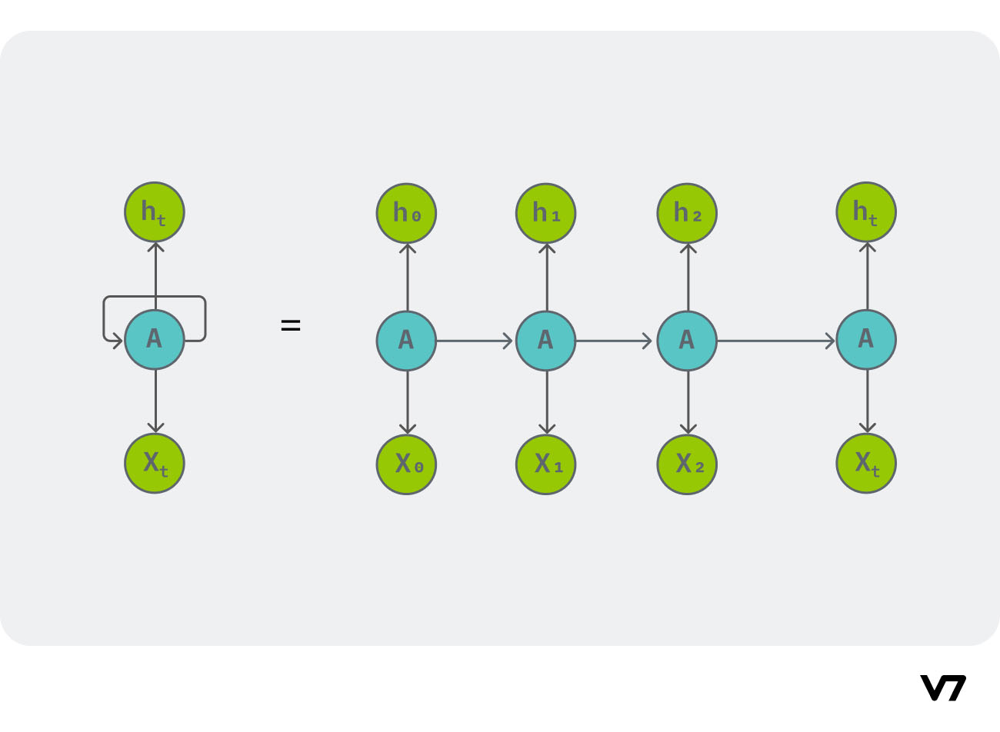
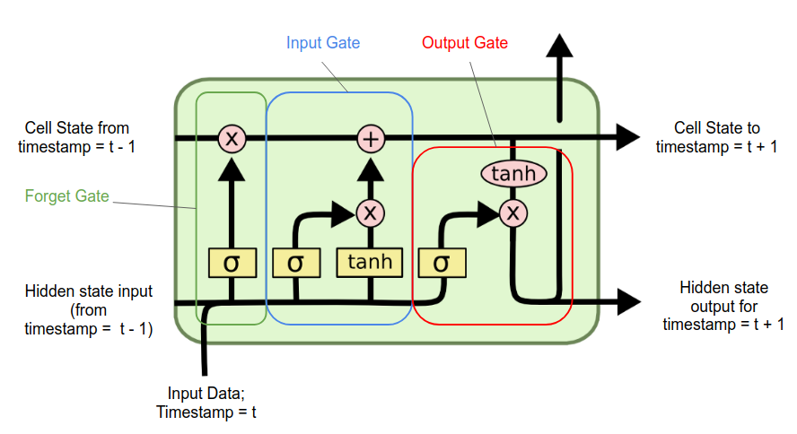

# Recurrent Neural Networks
RNNs are used to classify or generate sequencial data – data where the order of the data have importance. Also, RNNs are able to handle (sequencial) input of varying length. ie, it will perform even if there are 1000 data points or 20 data points for inference. Because of the sequencial nature, RNNs are used in text processing.

RNNs are able to handle sequencial data because they take in input as a sequential format, and not ‘all in one go’. RNNs are able to keep track of the sequence because of the feedback loop present in it - thus RNNs are not feed forward NNs. These feedback loops allow them to maintain a hidden state representing information from previous time steps in the sequence. Thus RNNs have memory, and can use that to process a sequence.

Each recurrent layer in an RNN takes two inputs – one is the input coming into the from the previous layer, and the other is the output of the same layer from the previous data. RNNs use a variation of backpropagation called Backpropagation Through Time (BPTT) to update the model's weights and biases. BPTT involves computing gradients through the entire sequence and updating the model parameters accordingly.

The major problems faced by RNNs are:
    1. Exploding and vanishing gradients
    2. As the length of the input sequence grows, the feature vectors from the beginning of the sequence tend to be “forgotten,” because the state of each unit, which serves as network’s memory, becomes significantly affected by the feature vectors read more recently.The short-term memory limitation of traditional recurrent neural networks is primarily due to the vanishing gradient problem.

## LSTM 
Long Short-Term Memory networks were specifically designed to address both the exploding and vanishing gradient problems as well as the long-term dependencies issue, making them a significant improvement over vanilla RNNs in these aspects.

LSTM networks have two kinds of memory – short and long term memory. Each LSTM cell has three gates –  the forget gate, the input gate and the output gate.

In each gate, the sigmoid activation function determines how much of the data is to be remembered.

### Forget gate
This gate decides how much of the data is to be remembered in the long term memory. The forget gate takes in the weighted sum of the input vector from tth and (t-1)th state, and pass them through a sigmoid function. This gives an output between 0 and 1, which will be multiplied with the long term memory. 

### Input gate
It inserts new memory to the long term memory. It takes in the weighted sum of the input vector from tth and (t-1)th state, and pass them through a sigmoid function and a tanh function. Then those two values are multiplied and added to the long term memory.

### Output gate
It gives out the output, derived from the input, long and short term memory which is to be passed to the next cell (or looped back in). It takes in the weighted sum of the input and short term memory and multiplies it with the tanh of the long term memory. This is the output, which is given out, as the short term memory of the next cell(or looped back in) and the y output from the cell.  
Read later: http://colah.github.io/posts/2015-08-Understanding-LSTMs/

 1. Autoencoders
 2. Generative Adversarial Networks (GANs)
 3. Self-Attention Models