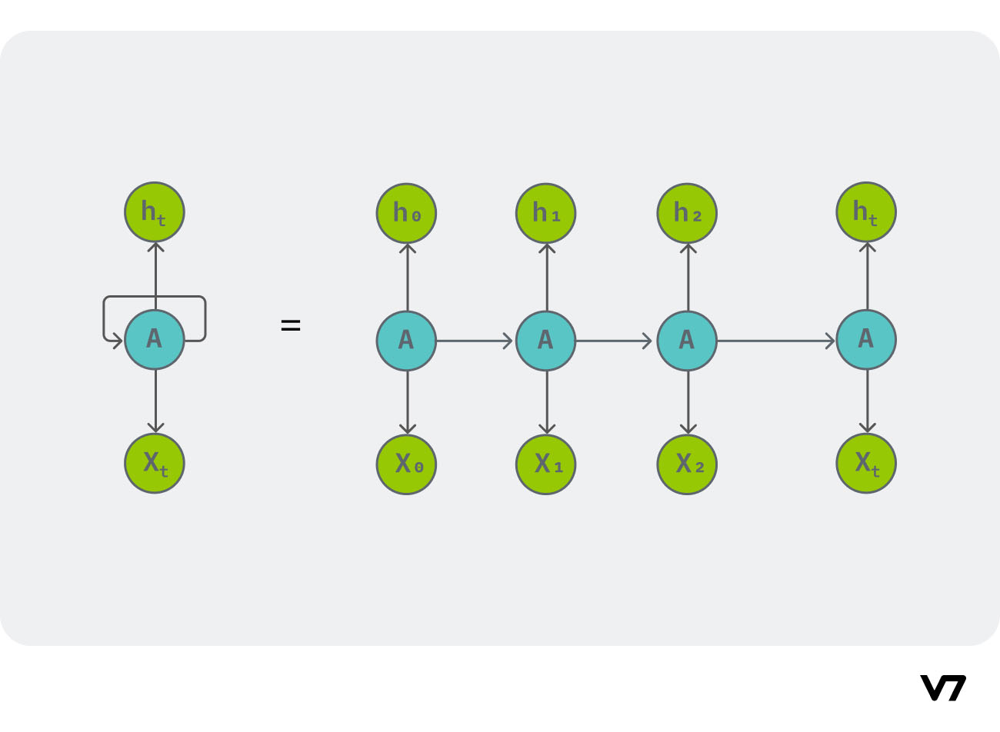

# Recurrent Neural Networks
RNNs are used to classify or generate sequencial data – data where the order of the data have importance. Also, RNNs are able to handle (sequencial) input of varying length. Because of this, RNNs can be used in text processing.

RNNs are able to handle sequencial data because they take in input as a sequential format, and not ‘all in one go’. They are able to keep track of the sequence because of the feedback loop present in it - thus RNNs are not feed forward NNs. These feedback loops allow them to maintain a hidden state representing information from previous time steps in the sequence. Thus RNNs have memory, and can use that to process a sequence. 

A problem with this is that RNNs can only use the previous words when processing a word - if the processing of a word requires a future word, it fails. This can be solved by using a bi-directional RNNs.

Each recurrent layer in an RNN takes two inputs – one is the input coming into the from the previous layer, and the other is the output of the same layer from the previous data. RNNs use a variation of backpropagation called Backpropagation Through Time (BPTT) to update the model's weights and biases. BPTT involves computing gradients through the entire sequence and updating the model parameters accordingly. Generally tanh activation functions are used throughout the hidden layers.

As the length of the input sequence grows, the feature vectors from the beginning of the sequence tend to be “forgotten,” because the state of each unit, which serves as network’s memory, becomes significantly affected by the feature vectors read more recently. **The short-term memory limitation of traditional recurrent neural networks is primarily due to the vanishing gradient problem.**
Another common problem is exploding gradients, where the numbers just blow up to NaNs.

While the exploding gradients can be easily solved by gradient clipping, vanishing gradients are hard to spot and solve.
