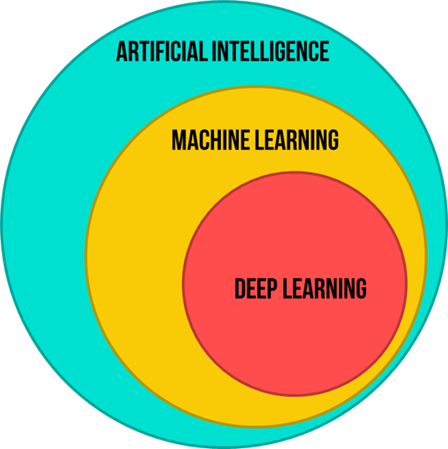

# Machine Learning

Machine Learning (ML) is a field of artificial intelligence focused on the development of algorithms and models that enable computers to learn from data and improve their performance on specific tasks. Instead of being explicitly programmed, these algorithms use statistical techniques to identify patterns, relationships, and trends within the data.
These models will never be perfect. They are meant to be 'good enough' to be used as an approximation.

“ML is data compression” – Another thought.

### AI, ML and DL

# Types of ML
	1. Supervised ML: 
  		  • Uses labelled data for training
  		  • Regression [Predict an exact value], Classification [Predicting the class]
	2. Unsupervised ML: 
  		  • Uses unlabelled dataset for training
 		  • Clustering, Dimensionality reduction, Anomaly detection
	3. Semi supervised ML: 
 		  • Mixture of labelled and unlabelled data. The qty of unlabeled data will be small. But it will vastly enhance the model’s performance.
 		  • One semi-supervised algorithm leverages the small amount of labeled data to guide its learning process, using the labeled examples to build a model and then extending its predictions to the unlabeled data.

# Basic ML workflow
    1) Data collection
    2) Data preprocessing, splitting and feature engineering
    3) Model selection 
    		a) Linear regression, Polynomial regression, Regression trees - Regression 
    		b) Logistic regression, Decision trees, SVM, K-nearest neighbours – Classfication
   			c) PCA – Dimensionality reduction
    		d) K-means – Clustering
    		e) NNs – pretty much everything 
    4) Model training
    	• Perform forward prop and compare it with the target to obtain an error measurement
    	• Use this error measurement to define loss function
    	• Extend loss function to entire dataset to get the cost function – the objective function
    	• Choose any optimisation algorithm (like  Gradient Descent) for optimising the objective function
    	• Repeat for any number of epoch you want
    5) Model evaluation - errors, accuracy, precision, recall, F1-score, etc.
    6) Model deployment/ monitoring/ maintainance

# Reinforcement Learning
Reinforcement learning (RL) is a type of machine learning paradigm where an agent learns how to behave in an environment by performing actions and receiving feedback in the form of rewards or punishments. The goal of the agent is to maximize the cumulative reward over time by discovering a strategy, or policy, that maps from states of the environment to actions.

In RL, we don't think in terms of 'good' actions. An action is considered 'good' if it is a part of a good policy (sequence of actions that lead to the goal state).

The learning process in reinforcement learning involves the agent exploring different actions in different states, receiving feedback in the form of rewards, and adjusting its policy to improve its decision-making capabilitie