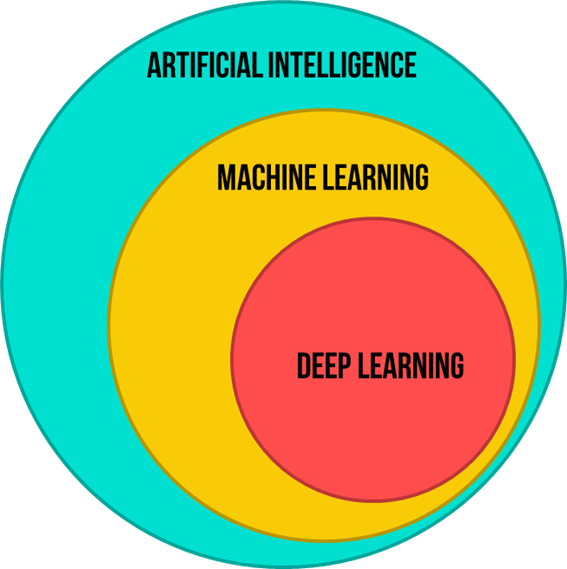

# Machine Learning

Machine Learning (ML) is a field of artificial intelligence focused on the development of algorithms and models that enable computers to learn from data and improve their performance on specific tasks. Instead of being explicitly programmed, these algorithms use statistical techniques to identify patterns, relationships, and trends within the data.

`Mitchell's definition of machine learning is as follows: A computer program is said to learn from experience E with respect to some task T and performance measure P, if its performance at task T, as measured by P, improves with experience E`

ML models are never meant to be perfect. They are meant to be 'good enough' to be used as an approximation.

	“ML is data compression” – Another thought.

### AI, ML and DL

# Types of ML Algorithms
	1. Supervised ML: 
  		  • Uses labelled data for training
  		  • Regression [Predict an exact value], Classification [Predicting the class]
	2. Unsupervised ML: 
  		  • Uses unlabelled dataset for training
 		  • Clustering, Dimensionality reduction, Anomaly detection
	3. Semi supervised ML: 
 		  • Mixture of labelled and unlabelled data. The qty of unlabeled data will be small. But it will vastly enhance the model’s performance.
 		  • One semi-supervised algorithm leverages the small amount of labeled data to guide its learning process, using the labeled examples to build a model and then extending its predictions to the unlabeled data.
	4. Reinforcement Learning: 
  		  - An agent is put in an environment, where it takes actions and recieves rewards or penalties based on its actions.
  		  - Eventually, this reward signals guides the agent to learn the best actions to take in different situations.