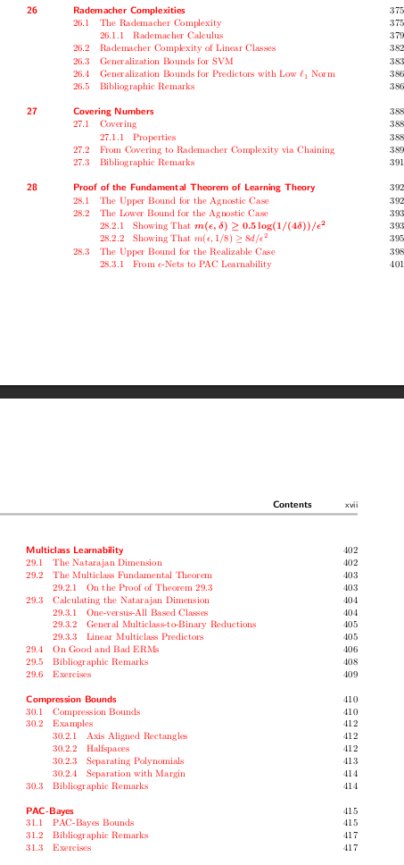

# Machine Learning

Machine Learning (ML) is a field of artificial intelligence focused on the development of algorithms and models that enable computers to learn from data and improve their performance on specific tasks. Instead of being explicitly programmed, these algorithms use statistical techniques to identify patterns, relationships, and trends within the data.

“ML is data compression” – Another thought.

# Types of ML
	1. Supervised ML: 
  		  • Labelled data for training
  		  • Regression [Predict an exact value], Classification [Predicting the class]
	2. Unsupervised ML: 
  		  • Unlabelled data
 		  • Clustering, Dimensionality reduction, Anomaly detection
	3. Semi supervised ML: 
 		  • Mixture of labelled and unlabelled data. The qty of unlabeled data will be small. 			But it will vastly enhance the model’s performance.
 		  • The algorithm leverages the small amount of labeled data to guide its learning 			process, using the labeled examples to build a model and then extending its 			predictions to the unlabeled data.

# Basic ML workflow
    1) Data collection
    2) Data preprocessing, splitting and feature engineering
    3) Model selection 
    		a) Linear regression, Polynomial regression, Regression trees - Regression 
    		b) Logistic regression, Decision trees, SVM, K-nearest neighbours – Classfication
   		c) PCA – Dimensionality reduction
    		d) K-means – Clustering
    		e) NNs – pretty much everything 
    4) Model training – for supervised algorithms
    • Perform forward prop and compare it with the target to obtain an error measurement
    • Use this error measurement to define loss function
    • Extend loss function to entire dataset to get the cost function – the objective function
    • Choose any optimisation algorithm (like  Gradient Descent) for optimising the objective function
    • Update parameters using any algorithm like Backpropogation
    • Repeat for any number of epoch you want
    5) Model evaluation - accuracy, precision, recall, F1-score, MSE, etc.
    6) Model deployment/ monitoring/ maintainance

