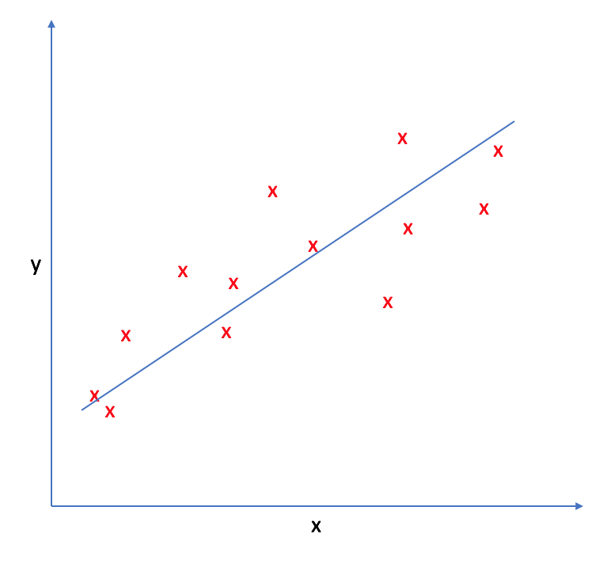
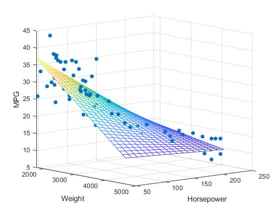

# REGRESSION

# 1. Linear Regression
Linear regression is a ML algorithm through which we develop a linear model of the data, and use it to perform prediction.

It may look like all the fine details of the data are lost when we are trying to assume it to fit in a linear model. In a sense, this is true. It is a strong (and somewhat unrealistic) assumption that our target y is a linear combination of the features. But looking at one-dimensional data gives a somewhat skewed perspective. For datasets with many features, linear models can be very powerful. In particular, if you have more features than training data points, any target y can be perfectly modeled (on the training set) as a linear function.

## Types
There are two types of linear regression:
1. **Simple linear regression**:

Uses f(x) = w.x + b as the model, where w and b are real number values. There is only one feature variable x to create the model, and the prediction y. The model ends up being a line in 2-dimensional plane.



2. **Multiple linear regression**:

In multiple linear regression, there are multiple feature variables and their corresponding weights. If there are n feature variables, the model will be a n+1 dimensional hyperplane in an n+1 dimensional space, with one dimension referring to the prediction value f(x).
The model is represented as 

```f(x) = w1.x1 + w2.x2 + . . . +wn.xn +b```

or as ```f(x) = W . X + b```, where W is n x m dimensional and b is n x 1 dimensional vectors. 

Here, the symbol ‘.’ (dot) represents dot product between w and x.



## 1. Defining model
The equation of linear model, used in simple linear regression is  
```f(x) = w.x + b```

## 2. Define optimisation function
The cost function is the function which is being optimised(minimised) inorder to get the optimal values w* and b*. For linear regression, the most common loss function is the Mean Squared Error (MSE). The MSE is a measure of the average squared difference between the predicted values and the actual target values for all the data points in your dataset. It's calculated as:

```Cost, J = (1/N) * Σ [ f(x) – y ]2```

This is the objective function. Here the loss function is (f(x) – y)^2, for one data point (x,y). The cost function is a term often used interchangeably with the loss function. The distinction between them can be subtle but generally, the loss function computes the error for a single data point, while the cost function calculates the overall error for the entire dataset, often as the average or sum of the individual losses.

The reason why we use squared error loss function is:
- The loss have to be positive. 
- The loss function should be easily derivable
- The graph should be smooth for GD to converge fast
  
## 3. Training
Training is the process of optimising the parameters to reach a goal (like reducing cost). One common optimisation method used for minimising the objective function is Gradient Descent,finding the optimal values of w(weights) and b(biases), denoted as w* and b*.

## 4. Evaluation
Involves using MSE, etc. for regression and precision, recall, accuracy, etc. for classification tasks.

# 2. Polynomial Regression
Polynomial Regression is a form of regression in which the relationship between the independent variable x and dependent variable y is modeled as an nth-degree polynomial. It  involves using polynomial functions to model the relationship between the feature variable(s) and the target variable. While the basic idea is similar to linear regression, the model is extended to capture non-linear relationships.

```f(x) = w1.x + w2.x^2 + . . . +wn.x^n + b ```

Higher-degree polynomials can fit more complex curves but might also lead to overfitting. Here, the relationship between the independent variable and the dependent variable is modeled as an nth-degree polynomial.