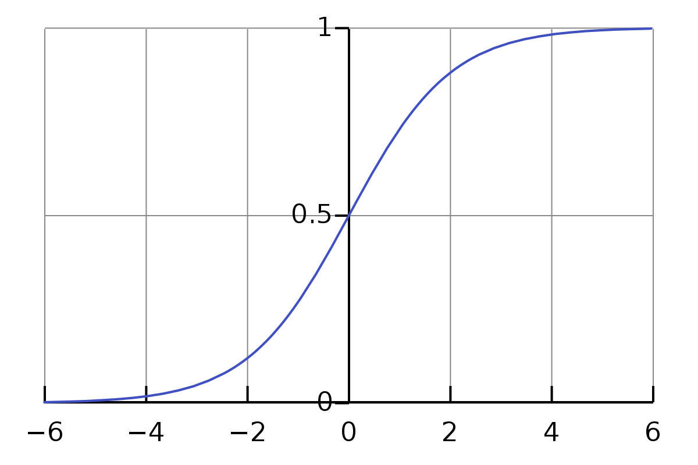
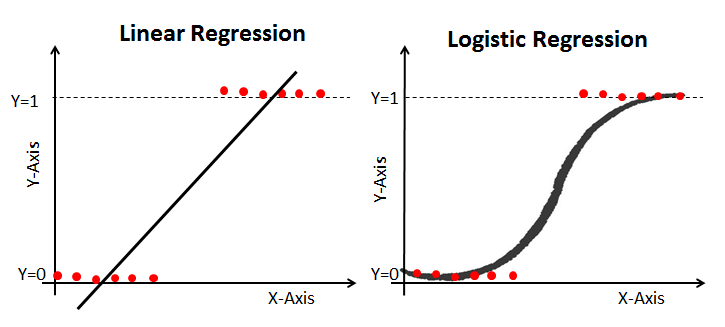

# Logistic Regression
Logistic regression is a ML algorithm used to perform classification - not regression. The name comes from statistics and is due to the fact that the mathematical formulation of logistic regression is similar to that of linear regression. Now, we could have used linear regression to solve this problem too, but liner model may cause huge mistakes for very obvious classifications. Hence we stick with the logistic regression model. Logistic regression can only do binary classification. But there is an extension to logistic regression (softmax algorithm), which lets us do multi class classification.

### Sigmoid function
This is a function that maps R to (0,1) as shown
It is defined as 		

```σ(x) = 1/1+e-x```



## 1. Model
Since this is a binary classification problem, the prediction is either 0 or 1. We first develop a linear model on the data as z = w.x + b. Then we apply the sigmoid function over it to get the probability that the output is 1.
So, 			
```f(x) = 1/1+e-z```

	where z = w.x + b
i.e, 			f(x) = 1/1+e-(w.x + b)



## 2. Optimisation function
We now need to define a cost function, which is to be optimised for finding the optimal values w* and b*. We cannot use the MSE cost function because it would lead to a non-convex curve, making it difficult for optimisation algorithms such as G.D to optimise [G.D might get stuck in a local minima]. 
So we define logistic loss function as
```
		        - log(f(x))	 if  y == 1
	Loss = 	
		        - log(1 – f(x))       if y == 0
```
or,

```Loss(f(x), y) =  - y log(f(x)) – (1 – y) log(1 – f(x))```

Since cost is the loss over the whole dataset, 
	Cost function = -(1/m) Σi=1m [ y log(f(x)) + (1 – y) log(1 – f(x)) ] 
This is convex and can be used by G.D to find w* and b*.

