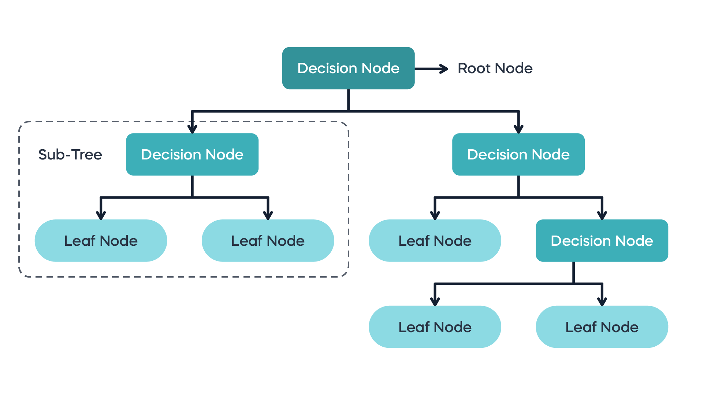

# Decision Tree Algorithm
The Decision Tree Algorithm is a supervised ML algorithm that leverages tree data structure. Every input is passed into a tree structure. In each branching node of the tree, a specific feature of the feature vector is examined. If the value of the feature is below a specific threshold, then the left branch is followed; otherwise, the right branch is followed. As the leaf node is reached, the decision is made about the class to which the example belongs.

Decision Trees are of two types:
 1. Classification trees
 2. Regression trees




Decision Trees are non parametric in nature. Non-parametric models make fewer assumptions about the underlying data distribution and aim to capture patterns directly from the data. These models can adapt to more complex relationships without assuming a specific functional form. They often require storing the entire training dataset, making them memory-intensive. ```They don’t create a compressed model that can be used to perform inference(like linear regression finding w* and b*).```

As each feature is processed separately, and the possible splits of the data don’t depend on scaling. No preprocessing like normalization or standardization of features is needed for decision tree algorithms.

Pruning in decision trees is a technique used to reduce the complexity of a decision tree model by removing branches (subtrees) that do not provide significant predictive power and may lead to overfitting. 

## Random Forest
A random forest is essentially a collection of decision trees, where each tree is slightly different from the others. The idea behind random forests is that each tree might do a relatively good job of predicting, but will likely overfit on part of the data. If we build many trees, all of which work well and overfit in different ways, we can reduce the amount of overfitting by averaging their results. Also, instead of looking for the best test for each node in each node,  the algorithm randomly selects a subset of the features, and it looks for the best possible test involving one of these features.

The randomness in building the random forest forces the algorithm to consider many possible explanations, the result being that the random forest captures a much broader picture of the data than a single tree.

## Gradient boosted regression trees
The gradient boosted regression tree is another ensemble method that combines multiple decision trees to create a more powerful model. Despite the “regression” in the name, these models can be used for regression and classification. In contrast to the random forest approach, gradient boosting works by building trees in a serial manner, where each tree tries to correct the mistakes of the previous one. By default, there is no randomization in gradient boosted regression trees; instead, strong pre-pruning is used. Gradient boosted trees often use very shallow trees, of depth one to five, which makes the model smaller in terms of memory and makes predictions faster.
Eg: XGBoost