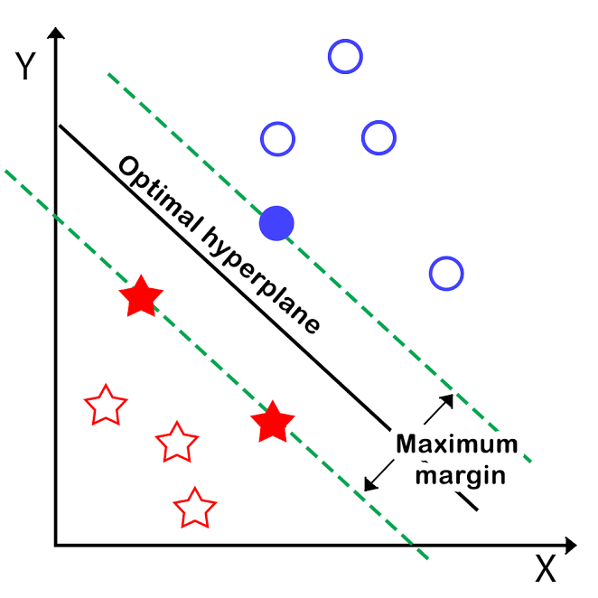
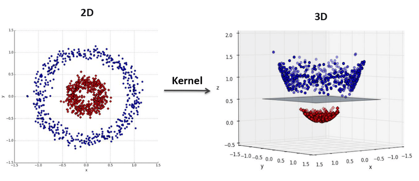

# 5. Support Vector Machines (SVM)
SVM sees every feature vector as a point in a high-dimensional space. The algorithm puts all feature vectors on an imaginary n-dimensional plot and draws an imaginary (n-1) dimensional  hyperplane[decision boundary] that separates examples with positive labels from examples with negative labels.

The equation of the hyperplane is given by two parameters, a real-valued vector w of the same dimensionality as our input feature vector x, and a real number b like this:

```wx − b = 0  (some people use wx + b = 0)```



We would also prefer that the hyperplane separates positive examples from negative ones with the largest margin, as it contributes to a better generalization. To achieve that, we needto minimize the Euclidean norm of w denoted by ||w||.

The goal of  SVM is to leverage the dataset and find the optimal values w* and b* for parameters w and b. Once the learning algorithm identifies these optimal values, the model f (x) is then defined as:
			f(x) = sign(w*. x − b* )

Thus, SVM creates a decision boundary on the data, which can be used for classification. It is very similar to linear regression, except for the fact that SVM tries to find a line that best separates the data points, while L.Regression tries to model a line that best fits in the data points.

## Kernel trick
If the datapoints cannot be separated by a linear hyperplane (inherent Non-Linearity in data), what will we do? Indeed, if we manage to transform the original space into a space of higher dimensionality, we could hope that the examples will become linearly separable in this transformed space. In SVMs, using a function to implicitly transform the original space into a higher dimensional space during the cost function optimization is called the kernel trick.

