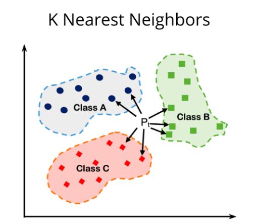

# 6. k-Nearest Neighbors
k-Nearest Neighbors (kNN) is a non-parametric learning algorithm. Contrary to other learning algorithms that allow discarding the training data after the model is built, kNN keeps all training examples in memory. One of the strengths of k-NN is that the model is very easy to understand, and often gives reasonable performance without a lot of adjustments. Using this algorithm is a good baseline method to try before considering more advanced techniques. Building the nearest neighbors model is usually very fast, but when your training set is very large, prediction can be slow.

Once a new, previously unseen example x comes in, the kNN algorithm finds k training examples closest to x and returns the majority label, in case of classification, or the average label, in case of regression. This comparison is done using methods like Euclidean distance or negative cosine similarity.
Considering more and more neighbors leads to a smoother decision boundary. A smoother boundary corresponds to a simpler model.

