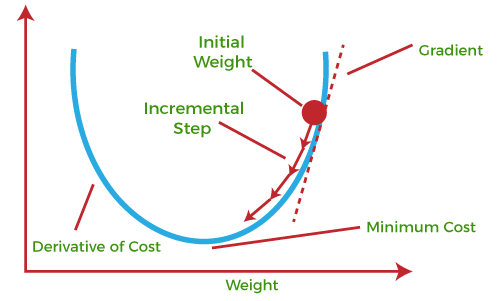

# 1. Gradient Descent 
Gradient descent is an iterative optimization algorithm for finding the local minima of a function. To find a local minimum of a function using gradient descent, one starts at some random point and takes steps proportional to the negative of the gradient (or approximate gradient) of the function at the current point. 

For many models, such as linear, logistic regression or SVM, the optimization criterion is convex. Convex functions have only one minimum, which is global. So, G.D can be used to get to the minima of the optimisation function. 

Linear regression has a closed form solution. That means that gradient descent is not needed to solve this specific type of problem. We can use linear algebra techniques to find w* and b*. However, for illustration purposes, linear regression is a perfect problem to explain gradient descent.

## Terms
- Epoch: Training of the whole dataset once on a model constitutes an epoch
- Learning Rate (ɑ): It refers to the size of one update. Bigger alpha leads to faster convergence, but risks overshooting.
- Parameter: The variables that changes (gets updated) during training. Eg: Weights, Biases
- Hyperparameter: The variables that are initially set, and is not changed throughout the training process. Eg: num_epochs, learning rate, etc.

## Working of Gradient Descent
    (1) Let our model be  f(x) = w.x + b
    (2) First we define cost function. Here we consider squared error cost function.
            J = (1/m) Σmi=1( [f(x) – y ]2 )
    (3) We now find the partial derivatives of J with respect to parameters w and b. Gradient is the vector which will lead to the maximum increase in the function. Negative of this gradient leads to maximum decrease. Gradient is nothing but partial derivatives w.r.t each variable written as component of a vector. Thus the vector sum of the partial derivatives gives gradient vector. So, negative partial derivative for a variable gives the change in that variable which will result in the highest decrement of the cost function.
    (4) So  we update each variable as:
                w = w – lr. ∂J/∂w
                b  = b – lr . ∂J/∂b
    (5) The learning rate (lr) is a hyperparameter that decides the length of every gradient descent step in the negative diection of gradient. It is typically a small value, set to the order of 10-4.
    (6) Do this over multiple epoch, and the function will converge at the minima. Then the values of w and b will be the optimal w* and b*.

### Optimisations
Gradient descent is also slow for large datasets.Minibatch stochastic gradient descent (minibatch SGD) is a version of the algorithm that speeds up the computation by approximating the gradient using smaller batches (subsets) of the training data. 

Adagrad is a version of SGD that scales α for each parameter according to the history of gradients.As a result, α is reduced for very large gradients and vice-versa. Momentum is a method that helps accelerate SGD by orienting the gradient descent in the relevant direction and reducing oscillations. In neural network training, variants of SGD such as RMSprop and Adam, are very frequently used.