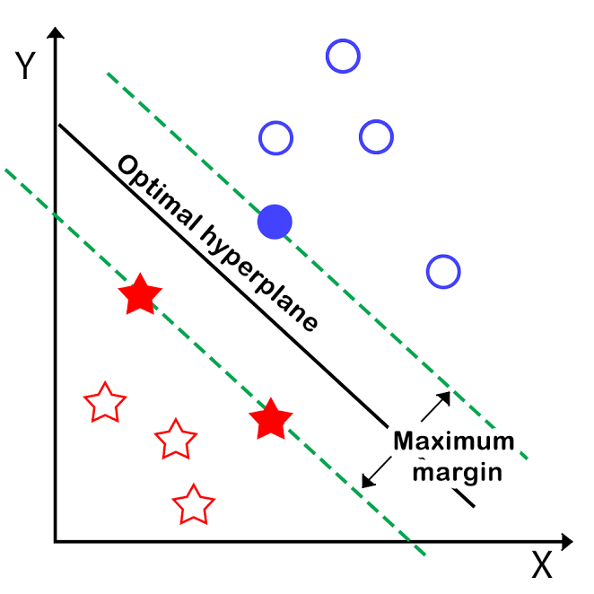
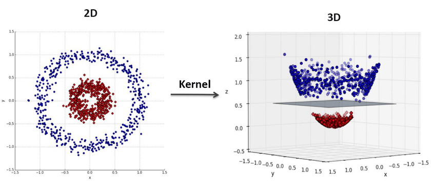
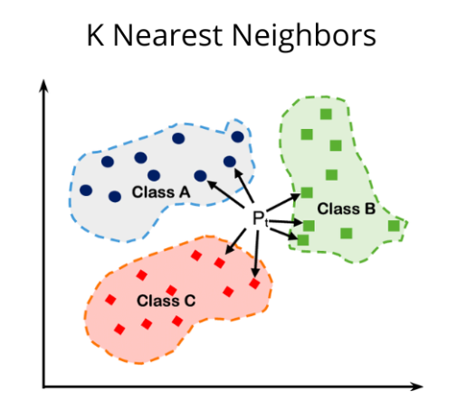

# 5. Support Vector Machines (SVM)
SVM sees every feature vector as a point in a high-dimensional space. The algorithm puts all feature vectors on an imaginary n-dimensional plot and draws an imaginary (n-1) dimensional  hyperplane[decision boundary] that separates examples with positive labels from examples with negative labels.

The equation of the hyperplane is given by two parameters, a real-valued vector w of the same dimensionality as our input feature vector x, and a real number b like this:

```wx − b = 0  (some people use wx + b = 0)```



We would also prefer that the hyperplane separates positive examples from negative ones with the largest margin, as it contributes to a better generalization. To achieve that, we needto minimize the Euclidean norm of w denoted by ||w||.

The goal of  SVM is to leverage the dataset and find the optimal values w* and b* for parameters w and b. Once the learning algorithm identifies these optimal values, the model f (x) is then defined as:
			f(x) = sign(w*. x − b* )

Thus, SVM creates a decision boundary on the data, which can be used for classification. It is very similar to linear regression, except for the fact that SVM tries to find a line that best separates the data points, while L.Regression tries to model a line that best fits in the data points.

## Kernel trick
If the datapoints cannot be separated by a linear hyperplane (inherent Non-Linearity in data), what will we do? Indeed, if we manage to transform the original space into a space of higher dimensionality, we could hope that the examples will become linearly separable in this transformed space. In SVMs, using a function to implicitly transform the original space into a higher dimensional space during the cost function optimization is called the kernel trick.



# 6. k-Nearest Neighbors
k-Nearest Neighbors (kNN) is a non-parametric learning algorithm. Contrary to other learning algorithms that allow discarding the training data after the model is built, kNN keeps all training examples in memory. One of the strengths of k-NN is that the model is very easy to understand, and often gives reasonable performance without a lot of adjustments. Using this algorithm is a good baseline method to try before considering more advanced techniques. Building the nearest neighbors model is usually very fast, but when your training set is very large, prediction can be slow.

Once a new, previously unseen example x comes in, the kNN algorithm finds k training examples closest to x and returns the majority label, in case of classification, or the average label, in case of regression. This comparison is done using methods like Euclidean distance or negative cosine similarity.
Considering more and more neighbors leads to a smoother decision boundary. A smoother boundary corresponds to a simpler model.




# 7. Naive Bayes Classifiers
Naive Bayes classifiers are a type of supervised machine learning model. The Naive Bayes classifier learns the statistical relationships between the input features and the class labels from the training data. It estimates the probabilities needed for classification, such as the prior probabilities of each class and the likelihood of observing each feature given a class.

The reason that naive Bayes models are so efficient is that they learn parameters by looking at each feature individually and collect simple per-class statistics from each feature.

There are three kinds of naive Bayes classifiers implemented in scikit-learn: GaussianNB, BernoulliNB, and MultinomialNB. GaussianNB can be applied to any continuous data, while BernoulliNB assumes binary data and MultinomialNB assumes count data (that is, that each feature represents an integer count of something, like how often a word appears in a sentence). BernoulliNB and MultinomialNB are mostly used in text data classification.
