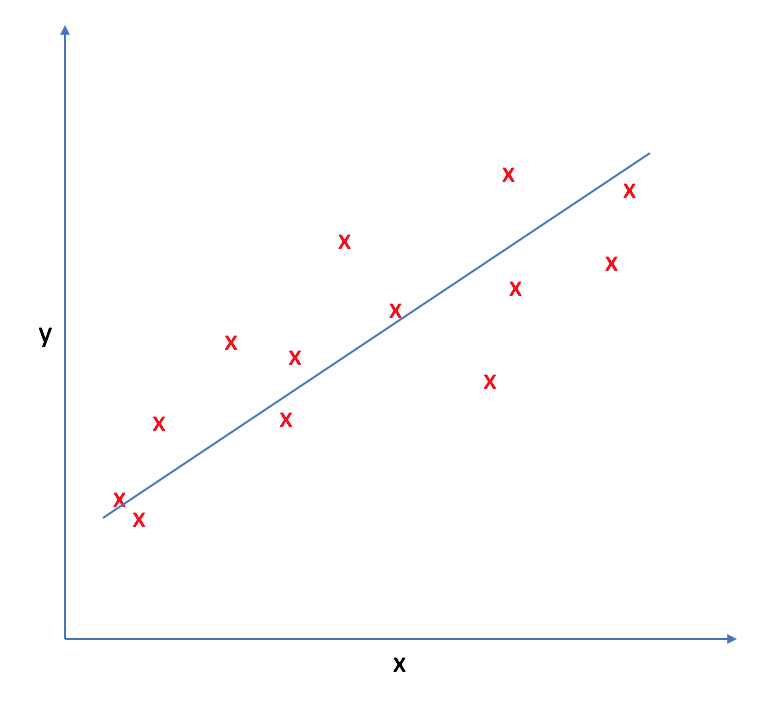
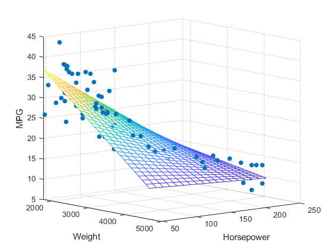
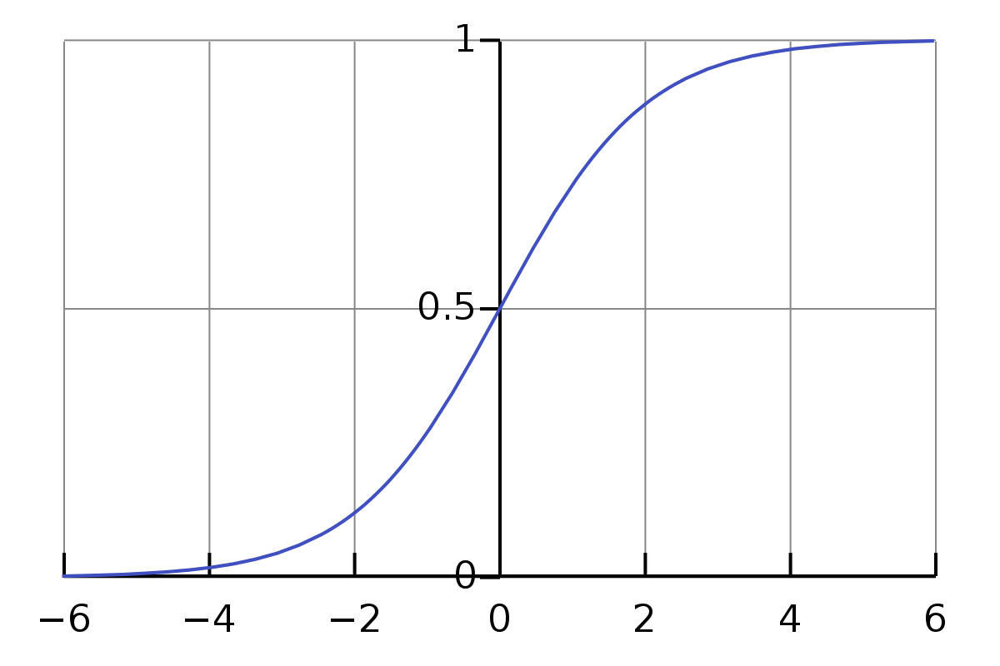
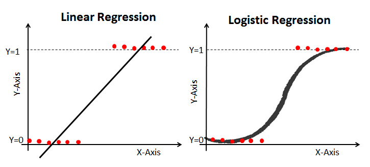
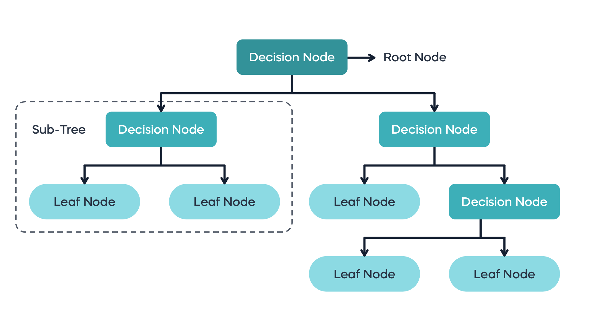

# Algorithms for Machine Learning
1. Linear Regression
2. Polynomial Regression
3. Logistic Regression
4. Decision Trees
5. SVMs
6. K nearest neigbours
7. Naive Bayes Classifiers

# 1. Linear Regression
Linear regression is a ML algorithm through which we develop a linear model of the data, and use it to perform prediction.
It may look like all the fine details of the data are lost when we are trying to assume it to fit in a linear model. In a sense, this is true. It is a strong (and somewhat unrealistic) assumption that our target y is a linear combination of the features. But looking at one-dimensional data gives a somewhat skewed perspective. For datasets with many features, linear models can be very powerful. In particular, if you have more features than training data points, any target y can be perfectly modeled (on the training set) as a linear function.

    The basic step of performing regression is
      - Define a model
      - Define optimisation function
      - Optimise the model using the loss function using any optimisation algorithm
      - Evaluate result

## Types

There are two types of linear regression:
1. Simple linear regression:
	Uses f(x) = w.x + b as the model, where w and b are real number values. There is only one feature variable x to create the model, and the prediction y. The model ends up being a line in 2-dimensional plane.


2. Multiple linear regression
	In multiple linear regression, there are multiple feature variables and their corresponding weights. If there are n feature variables, the model will be a n+1 dimensional hyperplane in an n+1 dimensional space, with one dimension referring to the prediction value f(x).
The model is represented as 
		f(x) = w1.x1 + w2.x2 + . . . +wn.xn +b
or as f(x) = W . X + b, where W is nXm dimensional and  b is nX1 dimensional vectors. Here, the symbol  ‘.’ (dot) represents dot product between w and x.



## 1. Defining model
The equation of linear model, used in simple linear regression is  
```f(x) = w.x + b```

We will use some optimisation algorithm (like SGD, OLS, etc.) to find the optimal values of w(weights) and b(biases), denoted as w* and b*, by defining a loss function, and trying to minimise it.
## 2. Define optimisation function
The cost function is the function which is being optimised(minimised) inorder to get the optimal values w* and b*. For linear regression, the most common loss or cost function is the Mean Squared Error (MSE). The MSE is a measure of the average squared difference between the predicted values and the actual target values for all the data points in your dataset. It's calculated as:

```Cost, J = (1/N) * Σ [ f(x) – y ]2```

This is the objective function. Here the loss function is (f(x) – y)2, for one data point (x,y). The cost function is a term often used interchangeably with the loss function. The distinction between them can be subtle but generally, the loss function computes the error for a single data point, while the cost function calculates the overall error for the entire dataset, often as the average or sum of the individual losses.
The reason why we use squared error loss function is:
- The loss have to be positive. 
- The loss function should be easily derivable
- The graph should be smooth for GD to converge fast
  
## 3. Training
Training is the process of optimising the parameters to reach a goal (like reducing cost). One common optimisation method used for minimising the objective function is Gradient Descent.
## 4. Evaluation
Involves using accuracy, precision, recall, etc. to measure the accuracy of the model.

# 2. Polynomial Regression
Polynomial Regression is a form of linear regression in which the relationship between the independent variable x and dependent variable y is modeled as an nth-degree polynomial. It  involves using polynomial functions to model the relationship between the feature variable(s) and the target variable. While the basic idea is similar to linear regression, the model is extended to capture non-linear relationships.

```f(x) = w1.x + w2.x2 + . . . +wn.xn + b ```

Higher-degree polynomials can fit more complex curves but might also lead to overfitting.The term "linear" in linear regression and polynomial regression refers to the linearity in the parameters (coefficients), not necessarily the relationship between variables.

# 3. Logistic Regression
Logistic regression is a ML algorithm used to perform classification (not regression : ). The name comes from statistics and is due to the fact that the mathematical formulation of logistic regression is similar to that of linear regression. Now, we could have used linear regression to solve this problem too, but liner model may cause huge mistakes for very obvious classifications. Hence we stick with the logistic regression model. Logistic regression can only do binary classification. But there is an extension to logistic regression (softmax algorithm), which lets us do multi class classification.

### Sigmoid function
This is a function that maps R to (0,1) as shown
It is defined as 		

```σ(x) = 1/1+e-x```



## 1. Model
Since this is a binary classification problem, the prediction is either 0 or 1. We first develop a linear model on the data (z = w.x + b). Then we apply the linear model on a sigmoid function to get the probability that the output is 1.
So, 			
```f(x) = 1/1+e-z```

	where z = w.x + b
i.e, 			f(x) = 1/1+e-(w.x + b)



## 2. Optimisation function
We now need to define a cost function, which is to be optimised for finding the optimal values w* and b*. We cannot use the MSE cost function because it would lead to a non-convex curve, making it difficult for optimisation algorithms such as G.D to optimise [G.D might get stuck in a local minima]. 
So we define logistic loss function as
```
		        - log(f(x))	 if  y == 1
	Loss = 	
		        - log(1 – f(x))       if y == 0
```
or,

```Loss =  - y log(f(x)) – (1 – y) log(1 – f(x))```

Since cost is the loss over the whole dataset, 
	Cost function = -(1/m) Σi=1m [ y log(f(x)) + (1 – y) log(1 – f(x)) ] 
This is convex and can be used by G.D to find w* and b*.


# 4. Decision Tree Algorithm
The Decision Tree Algorithm is a supervised ML algorithm that leverages tree data structure. Every input is passed into a tree structure. In each branching node of the tree, a specific feature of the feature vector is examined. If the value of the feature is below a specific threshold, then the left branch is followed; otherwise, the right branch is followed. As the leaf node is reached, the decision is made about the class to which the example belongs.

Decision Trees are of two types:
 1. Classification trees
 2. Regression trees




Decision Trees are non parametric in nature. Non-parametric models make fewer assumptions about the underlying data distribution and aim to capture patterns directly from the data. These models can adapt to more complex relationships without assuming a specific functional form. They often require storing the entire training dataset, making them memory-intensive. They don’t create a compressed model that can be used to perform inference(like linear regression finding w* and b*).

As each feature is processed separately, and the possible splits of the data don’t depend on scaling. No preprocessing like normalization or standardization of features is needed for decision tree algorithms.

Pruning in decision trees is a technique used to reduce the complexity of a decision tree model by removing branches (subtrees) that do not provide significant predictive power and may lead to overfitting. 


## Random Forest
A random forest is essentially a collection of decision trees, where each tree is slightly different from the others. The idea behind random forests is that each tree might do a relatively good job of predicting, but will likely overfit on part of the data. If we build many trees, all of which work well and overfit in different ways, we can reduce the amount of overfitting by averaging their results. Also, instead of looking for the best test for each node in each node,  the algorithm randomly selects a subset of the features, and it looks for the best possible test involving one of these features.

The randomness in building the random forest forces the algorithm to consider many possible explanations, the result being that the random forest captures a much broader picture of the data than a single tree.

## Gradient boosted regression trees
The gradient boosted regression tree is another ensemble method that combines multiple decision trees to create a more powerful model. Despite the “regression” in the name, these models can be used for regression and classification. In contrast to the random forest approach, gradient boosting works by building trees in a serial manner, where each tree tries to correct the mistakes of the previous one. By default, there is no randomization in gradient boosted regression trees; instead, strong pre-pruning is used. Gradient boosted trees often use very shallow trees, of depth one to five, which makes the model smaller in terms of memory and makes predictions faster.
Eg: XGBoost

# 5. Support Vector Machines (SVM)
SVM sees every feature vector as a point in a high-dimensional space. The algorithm puts all feature vectors on an imaginary n-dimensional plot and draws an imaginary (n-1) dimensional  hyperplane[decision boundary] that separates examples with positive labels from examples with negative labels.

The equation of the hyperplane is given by two parameters, a real-valued vector w of the same dimensionality as our input feature vector x, and a real number b like this:

```wx − b = 0  (some people use wx + b = 0)```


We would also prefer that the hyperplane separates positive examples from negative ones with the largest margin, as it contributes to a better generalization. To achieve that, we needto minimize the Euclidean norm of w denoted by ||w||.

The goal of  SVM is to leverage the dataset and find the optimal values w* and b* for parameters w and b. Once the learning algorithm identifies these optimal values, the model f (x) is then defined as:
			f(x) = sign(w*. x − b* )

Thus, SVM creates a decision boundary on the data, which can be used for classification. It is very similar to linear regression, except for the fact that SVM tries to find a line that best separates the data points, while L.Regression tries to model a line that best fits in the data points.

## Kernel trick
If the datapoints cannot be separated by a linear hyperplane (inherent Non-Linearity in data), what will we do? Indeed, if we manage to transform the original space into a space of higher dimensionality, we could hope that the examples will become linearly separable in this transformed space. In SVMs, using a function to implicitly transform the original space into a higher dimensional space during the cost function optimization is called the kernel trick.


# 6. k-Nearest Neighbors
k-Nearest Neighbors (kNN) is a non-parametric learning algorithm. Contrary to other learning algorithms that allow discarding the training data after the model is built, kNN keeps all training examples in memory. One of the strengths of k-NN is that the model is very easy to understand, and often gives reasonable performance without a lot of adjustments. Using this algorithm is a good baseline method to try before considering more advanced techniques. Building the nearest neighbors model is usually very fast, but when your training set is very large, prediction can be slow.

Once a new, previously unseen example x comes in, the kNN algorithm finds k training examples closest to x and returns the majority label, in case of classification, or the average label, in case of regression. This comparison is done using methods like Euclidean distance or negative cosine similarity.
Considering more and more neighbors leads to a smoother decision boundary. A smoother boundary corresponds to a simpler model.


# 7. Naive Bayes Classifiers
Naive Bayes classifiers are a type of supervised machine learning model. The Naive Bayes classifier learns the statistical relationships between the input features and the class labels from the training data. It estimates the probabilities needed for classification, such as the prior probabilities of each class and the likelihood of observing each feature given a class.

The reason that naive Bayes models are so efficient is that they learn parameters by looking at each feature individually and collect simple per-class statistics from each feature.

There are three kinds of naive Bayes classifiers implemented in scikit-learn: GaussianNB, BernoulliNB, and MultinomialNB. GaussianNB can be applied to any continuous data, while BernoulliNB assumes binary data and MultinomialNB assumes count data (that is, that each feature represents an integer count of something, like how often a word appears in a sentence). BernoulliNB and MultinomialNB are mostly used in text data classification.
