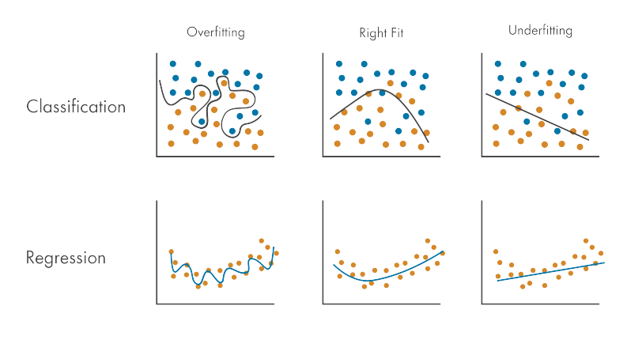

# UNDERFITTING and OVERFITTING


# Underfitting
If the model makes many mistakes on the training data, we say that the model has a high bias or that the model underfits. Underfitting is the inability of the model to predict well the labels of the data it was trained on.

Reasons:
- Model is too simple
- The features you engineered are not informative enough

# Overfitting
The model that overfits predicts very well the training data but poorly the data from at least one of the two holdout sets. It is also called the problem of high variance.
```Regularization``` is the most widely used approach to prevent overfitting.

Reasons:
- The model is too complex for the data
- You have too many features but a small number of training examples
  
### Regularisation
Regularization is an umbrella term that encompasses methods that force the learning algorithm to build a less complex model, to reduce overfitting. In practice, that often leads to slightly higher bias but significantly reduces the variance. 

To create a regularized model, we modify the objective function by adding a penalizing term whose value is higher when the model is more complex.

A regularised cost function is:

	J = (1/m) Σmi=1( [f(x) – y ]2 ) + (λ/2m)Σnj=1 ||w||2   (L2 regularisation)
	    	
            where  λ is the regularisation parameter, and is manully set.
			when  λ == 0:  no regularisation (potential overfitting)
			when  λ == very big(1010):  high regularisation(potential underfitting)

- Another regularisation technique is dropout regularisation, which is used on NN. Here, neurons from layers are randomly ‘switched off’. This leads to simpler networks – reducing overfitting. 