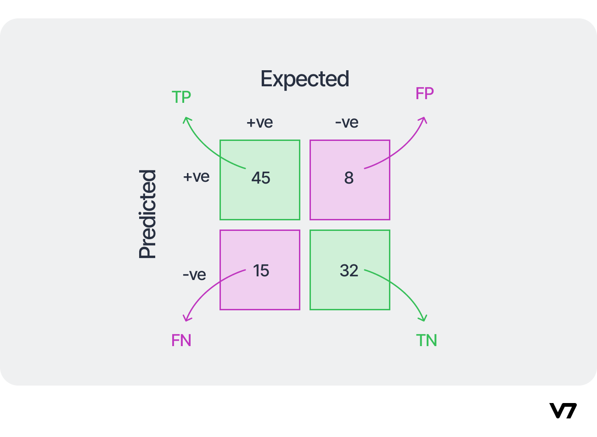

# Evaluation Criterions

## 1. Regression Models
The evaluation criterion for regression models include
 - Mean Squared Error(MSE) - **the most popular**
 - Mean Absolute Error (MAE)
 - R-squared (R2)

If the MSE of the model on the test data is substantially higher than the MSE obtained on the training data, this is a sign of overfitting. If both underperforms, it is underfitting.
                   
## 2. Classification Models

### Confusion Matrix
The confusion matrix is a table that summarizes how successful the classification model is at predicting examples belonging to various classes. One axis of the confusion matrix is the label that the model predicted, and the other axis is the actual label. Confusion matrix is used to calculate two other performance metrics: precision and recall.



It also helps us to have an idea about where the prediction is going wrong. This can help us address that problem with more data focusing on that problem.

### Precision and Recall – Best for skewed class prediction
- Precision is the ratio of correct positive predictions to the overall number of positive predictions. 
```Precision = TP/ (TP+FP)```

      High precision => if prediction == Positive: result = Positive  # says +ve only if sure

- Recall is the ratio of correct positive predictions to the overall number of correct predictions in the dataset.
```Recall = TP/ (TP+FN)```

      High recall => if  result == Positive: prediction = Positive # says +ve if there is a chance

Almost always, in practice, we have to choose between a high precision or a high recall. It’s usually impossible to have both.

### Accuracy 
Accuracy is given by the number of correctly classified examples divided by the total number of classified examples.

```Accuracy = (TP + TN)/ (TP + TN + FP + FN)```

#### Cost-sensitive Accuracy

For dealing with the situation in which different classes have different importance, a useful metric is cost-sensitive accuracy. To compute a cost-sensitive accuracy, you first assign a cost (a positive number) to both types of mistakes: FP and FN. You then compute the counts TP, TN, FP, FN as usual and multiply the counts for FP and FN by the corresponding cost before calculating the accuracy

#### Area under the ROC Curve
didn’t read