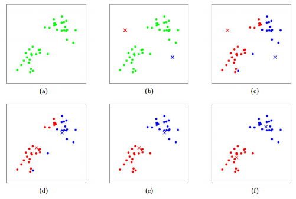

# Clustering

Clustering algorithms are a category of unsupervised learning techniques that group similar data points together into clusters or clusters of data points with similar characteristics. There is a variety of clustering algorithms, and, unfortunately, it’s hard to tell which one is better in quality for your dataset. Usually, the performance of each algorithm depends on the unknown properties of the probability distribution that the dataset was drawn from.

## K-Means
- The k-means clustering algorithm works as follows. First, you choose k — the number of clusters. Then you randomly put k feature vectors, called centroids, to the feature space. 
- We then compute the distance from each example x to each centroid c using some metric, like the Euclidean distance. Then we assign the closest centroid to each example (like if we labeled each example with a centroid id as the label).
- For each centroid, we calculate the average feature vector of the examples labeled with it. These average feature vectors become the new locations of the centroids.
- We recompute the distance from each example to each centroid, modify the assignment and repeat the procedure until the assignments don’t change after the centroid locations were recomputed. The model is the list of assignments of centroids IDs to the examples. 

The initial position of centroids influence the final positions, so two runs of k-means can result in two different models. Some variants of k-means compute the initial positions of centroids based on some properties of the dataset.

They k value for k-means is generally estimated via elbow method.

## 2. DBSCAN and HDBSCAN
They are clustering algorithms. Didn’t read more.