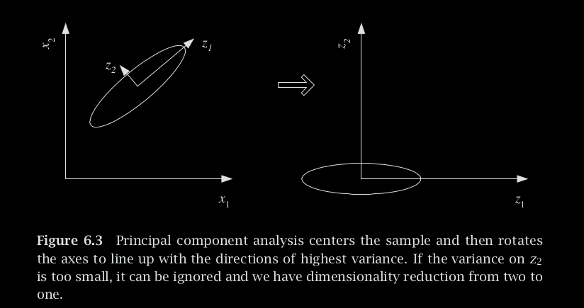
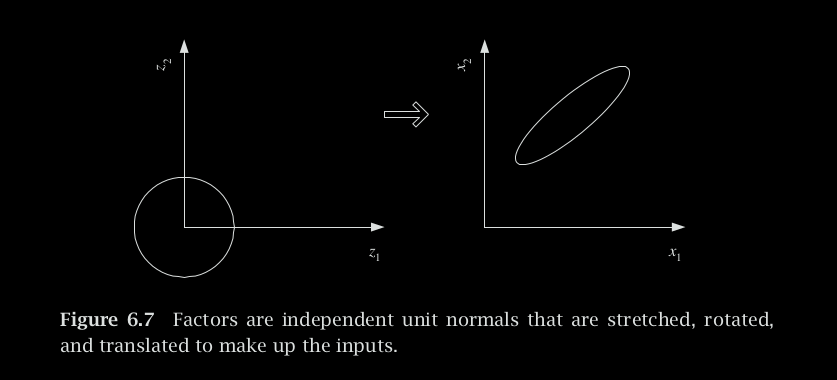

# Dimensionality Reduction
Dimensionality reduction is a technique in machine learning and statistics aimed at reducing the number of features or variables in a dataset. The primary goal is to simplify the dataset while retaining its essential information. High-dimensional data, where the number of features is large, can suffer from various issues, including increased computational complexity, the curse of dimensionality, and difficulties in visualization and interpretation.

There are two main types of dimensionality reduction:

### 1. Feature Selection:
Feature selection involves selecting a subset of the original features while discarding others. This process is based on criteria such as feature importance, correlation with the target variable, or other statistical measures. The selected features form a reduced-dimensional representation of the dataset.

There are two approaches
- **Forward selection**: We start with no variables and add them one by one, at each step adding the one that decreases the error the most, until any further addition does not decrease the error (or decreases it only slightly).
- **Backward selection**: We start will all features, and remove features from them, constantly monitoring the loss.

### 2. Feature Extraction:
It involves transforming the original features into a new set of features, typically of lower dimensionality. Principal Component Analysis (PCA) and t-distributed Stochastic Neighbor Embedding (t-SNE) are examples of feature extraction techniques. These methods aim to capture the most important information in the data in a reduced number of features.

Common methods for dimensionality reduction include:
- Principal Component Analysis (PCA):
- t-Distributed Stochastic Neighbor Embedding (t-SNE):
- Autoencoders:
- Linear Discriminant Analysis (LDA):

## Principal Component Analysis
Principal Component Analysis (PCA) is a dimensionality reduction technique, that transforms high-dimensional data into a new coordinate system, where the axes are the principal components. The principal components are orthogonal vectors that capture the maximum variance in the data. By focusing on the most significant features, PCA allows for a reduction in dimensionality while retaining as much of the original information as possible.

## Factor Analysis
Factor Analysis aims to identify latent (unobservable) factors that contribute to the observed variables in a dataset. It assumes that the observed variables are linear combinations of these latent factors and error terms.

Principal component analysis generates new variables that are linear combinations of the original input variables. In factor analysis, however, we posit that there are factors that when linearly combined generate the input variables.

## Linear discriminant analysis 
Linear discriminant analysis (LDA) is a supervised method for dimension-
ality reduction for classification problems.

