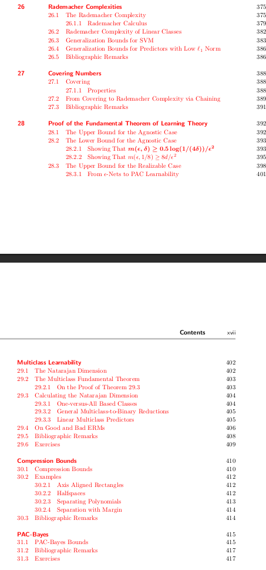

# Machine Learning Topics

## 1. Introduction
- What is Machine Learning
- how it works
- Understanding Data
- Machine Learning Workflow

## 2. Basic Theoretical concepts
- Concept of learning
  - statistical model
  - empirical risk minimisation
  - PAC learning
    - fundemental theorem of pac(comes later in book)
  - a more general model
  - learning via uniform convergence
- Bias complexity tradeoff
- error decomposition
- VC dimension
- Non uniform learnability
- Runtime of learning
- 

- Introductory Concepts
- Basic Theoretical Concepts

## 2. Supervised Learning Algorithms
- Overview and Types
- How it actually works
- Linear Regression
  - least squares
- Logistic Regression
- Decision Trees
  - weak learnability
  - random forest
  - adaboost
- Support Vector Machines (SVM)
  - hard, soft
  - regularisation
  - optimality conditions
  - dulaity
  - kernel methods
- K-Nearest Neighbors (KNN)
- Naive Bayes

## 3. Optimization Algorithms
- Gradient Descent
- Adam Optimizer

## 6. Unsupervised Learning Algorithms
- Introduction to Unsupervised Learning
- Density Estimation
- Clustering Techniques
  - k-means
  - spectral clustering
  - 
- Dimensionality Reduction
  - PCA
  - 
- Anomaly Detection
- 
## 4. Machine Learning Concepts and techniques
- Feature Engineering
- Vectorization and Broadcasting
- Different Learning Strategies
- Ensemble Methods
- Boosting and bagging
- Multiclass, ranking and complex prediction problems

## 5. Model Evaluation
- Model selection
  - k-fold cross validation
  - Understanding Three Dataset Types
- Evaluation Criteria
- Hyperparameter Tuning
- Practical Hyperparameter Optimization
  - Example with Cellphone Dataset

## Regularisation
- Overfitting and Underfitting
- 

## Reinforcement Learning
- Introduction to Reinforcement Learning

## Things which i dont know where to put
- Convex learning problem
- online learning
- generative models
- Feature Selection and Generation

## Advanced concepts: 
- 

## Books
- Understanding Machine Learning: From theories to algorithsm
- Pattern Recognition and Machine Learning, Bishop