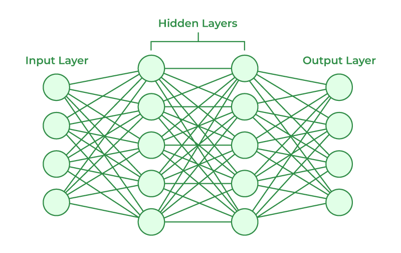
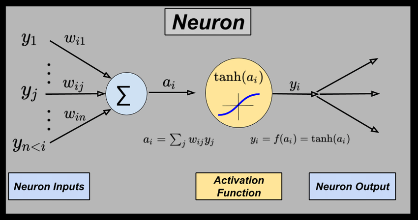

# Neural Networks
Deep learning is a supervised ML algorithm that uses deep neural networks [nn with more than two layers] as its model. 
Artificial neural networks (ANNs) are comprised of neuron layers, containing an input layer, one or more hidden layers, and an output layer.
It can be visualised as a graph data structure. Each edge of the NN has a weight. Each neuron is associated with a bias. 

## Deep learning
It is the sub-field of ML that uses deep neural networks(NNs with more than one hidden layer) as the model.

## Working of a Neuron
The output from previous layers is added together after multipling with the weight. 
The bias is also added to this. This is the linear input from the previous layer. 
This is passed through an activation function (like ReLu or tanh) and is passed out as the output.

### Activation Function
The activation function is a mathematical operation that is applied to the output of a neuron before it is passed on to the next neuron. 
The activation function determines how the neuron will respond to its inputs. It activates a neuron, based on a threshold. 
Some activation functions are:
 - Sigmoid function: f(z) = 1/(1+e-z)
 - Linear function : f(z) = z. (or ‘no function’).
 - ReLu (Rectified linear activation function): f(z) = max(0,z). It is preferred in hidden layers.
 - tanh: Another popular activation function for hidden layers.

### Architecture of a NN
A NN has the following layers
1. Input layer - generally not counted as layers as they dont contain trainable parameters
2. Hidden layers - Contains trainable parameters and activation functions like relu or tanh
3. Output layer - Ends with an activation function like sigmoid or softmax

## Types of Neural Networks
1. Multi-layer Perceptron
2. For image processing
   1. Convolutional Neural Network
3. For sequntial data processing
   1. Recurrent Neural Network
      1. LSTM: Improved RNN
      2. GRU: Simpler LSTM
   2. Transformers
4. GANs
5. Auto encoder Neural Networks