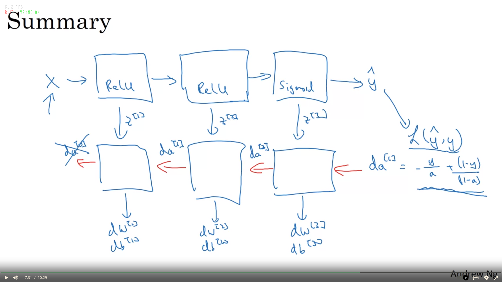

# Backpropogation 
Training is the process by which a neural network eats the data, and updates its parameters such that the loss is reduced. Backpropagation is the most popular algorithm used to compute the gradients of the loss function with respect to the model's parameters, for each layer.These gradients are subsequently used to update parameters.

In neural networks, it is essential to initialize the weights and biases as random numbers, as vice versa will lead to equal gradients for all features. This lead to the no convergence, regardless of the number of epochs.

The backpropagation algorithm works as follows:
 1. **Forward pass:** The network propagates the input data forward through the network, calculating the output of neural network. The error between the network's prediction and the target is used to form a loss function, and eventually a cost function. During actual implementation, we cache w[l], b[l] and z[l] for every layer, so that they are readily available for back propogation.

 2. **Loss definition and Gradient Calculation:** The loss function is defined with the help of y and y_pred. Then the partial derivative of the loss is calculated with respect to each parameter. The negative gradient of the cost function points in the direction of steepest descent, which helps to minimize the cost function.

 3. **Backward Pass**: The network's parameters are updated using the corresponding gradients. The learning rate, a hyperparameter, is multiplied by the gradient to determine the step size. This step size controls the rate at which the parameters are adjusted. One iteration of backpropagation involves updating the parameters based on the calculated gradients for the given batch of data. An epoch consists of multiple iterations, where each iteration updates the parameters using a different batch of data.
   
    It is implemented as:  
    ```  
    At each layer l,
        dZ[l] = dA[l] * g[l]’(Z[l]) 
        dW[l] = (1/m) dZ[l]. A[l-1]T
        db[l] = (1/m) np.sum(dZ[l], axis=1, keepdims=True)	
        dA[l-1] = W[l]T . dZ[l]
    ```
