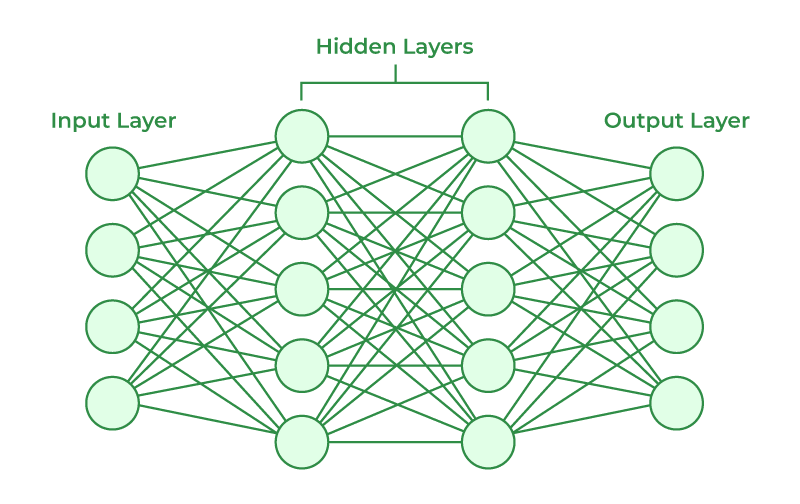
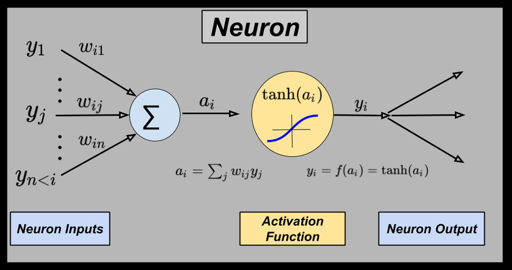

# Neural Networks
Deep learning is a supervised ML algorithm that uses deep neural networks [nn with more than two layers] as its model. Artificial neural networks (ANNs) are comprised of neuron layers, containing an input layer, one or more hidden layers, and an output layer. It can be visualised as a graph data structure. Each edge of the NN has a weight. Each neuron is associated with a bias. 

## Working of a Neuron
The output from previous layers is added together after multipling with the weight. The bias is also added to this. This is the linear input from the previous layer. This is passed through an activation function (like ReLu or tanh) and is passed out as the output.

# Types of Neural Networks
1. Multilayer Perceptrons
2. For image processing
   1. Convolutional Neural Network
3. For sequntial data processing
   1. Recurrent Neural Networks
      1. LSTM: Improved RNN
      2. GRU: Simpler LSTM
   2. Transformers
4. GANs
5. Auto encoder Neural Networks