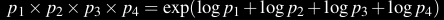

# Language models
Language models are computational models that are designed to understand, generate, and process human language in a way that mimics human-like understanding and production. They do this by trying to predict the next word from the previous words(context). 

- The term "large language model" typically refers to language models that have a vast number of parameters and are trained on massive datasets. 

There are two types of language models - Statistical and NN based

## Statistical Language models
Statistical language models are a type of model that use statistical patterns in the data to make predictions about the likelihood of specific sequences of words. A basic approach to building a probabilistic language model is to calculate n-gram probabilities.

An n-gram model is a type of probabilistic language model used in natural language processing and computational linguistics. It predicts the likelihood of a word given the previous (n-1) words. The model calculates the probability of a word occurring based on the frequency of its n-gram in the training data. They estimate the probability of a word given its context using counts of occurrences of words or sequences of words in a training corpus. The probability distribution is calculated based on observed frequencies in the training data.
Eg: bigram(n-gram model with n=2), trigram(n=3), etc

- We use MLE to estimate the probability of words.
- We always represent and compute language model probabilities in log format as log probabilities. Since probabilities are small numbers, multiplying enough n-grams together would result in numerical underflow. We can just add up the log probabilities.

### Markov Assumption
The assumption that the probability of a word depends only on the previous word is called a Markov assumption. Markov models are the class of probabilistic models that assume we can predict the probability of some future unit without looking too far into the past.

## Neural language based language models
Neural language models use neural networks to predict the likelihood of a sequence of words. These models are trained on a large corpus of text data and are capable of learning the underlying structure of the language. They typically use NNs like RNNs, LSTMs and transformers.

They learn complex patterns and representations from large amounts of text data, allowing them to capture long-range dependencies and semantic relationships between words.

# Evaluating Language models

## Extrinstic
The best way to evaluate the performance of a language model is to embed it in an application and measure how much the application improves. Such end-to-end evaluation is called extrinsic evaluation.

## Intrinstic
An intrinstic way to evaluate the probability is by using perplexity. The perplexity (sometimes abbreviated as PP or PPL) of a language model on a test set is the inverse probability of the test set (one over the probability of the test set), normalized by the number of words. For this reason it’s sometimes called the per-word perplexity.

The lower the perplexity of a model on the data, the better the model, and minimizing perplexity is equivalent to maximizing the test set probability according to the language model.