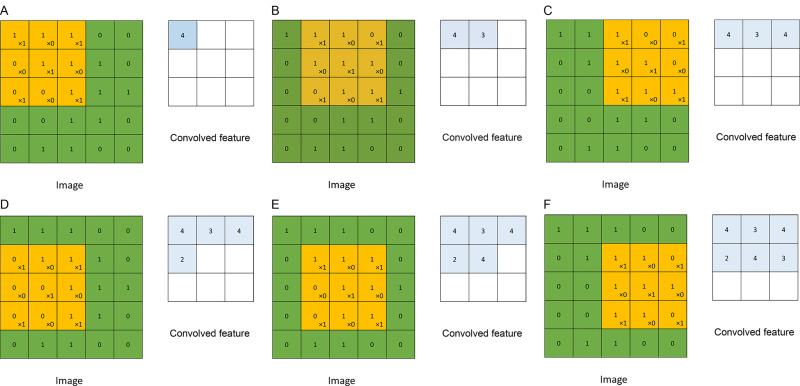
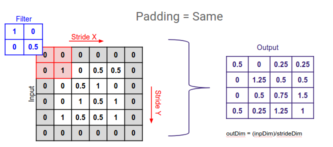
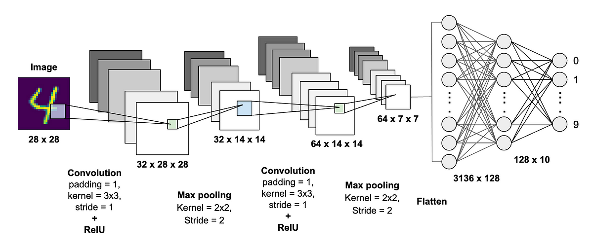
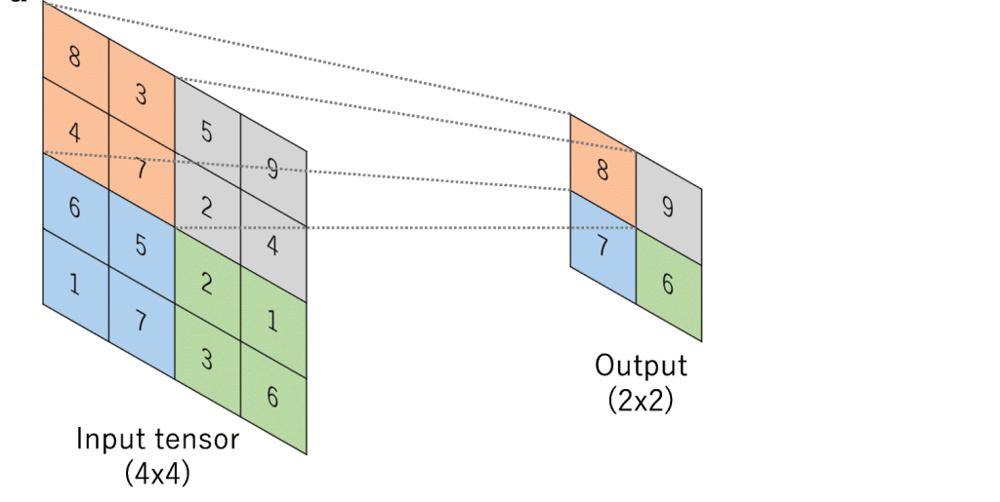

# Neural Networks for Image processing (CNNs)

Whenever we are working with image data, we end up having a lot of features. This makes the nn very hard to train and prone to overfitting, because of the sheer volume of parameters. A good way to solve this problem is by using CNNs.

# Convolution
Convolution is performed using a convolutional kernel (also called a filter), which is a small matrix that slides or "convolves" across the input data, element-wise multiplying and summing values as it goes. The result is a feature map that represents certain features or patterns in the input data. 

The filters will have the same number of channels as the convolution layer. The number of channels in the output after convolution is the **number of filters** used for convolution

Convolution can be used to detect edges in an image. Therefore, we design NN, which encoporates convolution for image processing.

Different types of kernels are used to detect different edges. This image shows the idea.

In reality, we can use Sobel or Scharr filter, which perform better. **A  better idea is to treat the filter itself as a learnable parameter, and learn it via backpropogation.** This is the way convolution is implemented in CNNs.

**NOTE:** In mathematics, convolution is always preceded by flipping the filter. In CS, we don't do that as it will not have any advantage. So, according to Mathematics theory, what we are doing is called 'cross-correlation', not convolution.

## Padding
Padding allows getting a larger output matrix, after covolution is performed. The cells added by padding usually contain zeroes.

## Stride 
We step the convolution of the matrix by the filter by 'stride' number of steps. 

## Convolution over 3 dimensions
Just like 2d, convolution can be extended to three dimensions as:

Thus a 3d image, convolved on a 3d filter gives a 2d output.

# Convolutional Neural Network
A convolutional neural network (CNN) is a special kind of feed forward NN that significantly reduces the number of parameters in a deep neural network, by appllying convolution in it. It generally takes input in matrix form and was designed to work on image processing, as an image consists of block of information as a chunk.

A CNN typically has three layers: 
 - convolutional layer
 - pooling layer
 - fully connected layer  
  
These layers work together to learn patterns and edges in input data(images).

Generally in a CNN, as we go deeper into the layers, the height and width decreases and the number of channels(depth of the kernel) increases.

## Computational Cost for Convolution

## 1. Convolution Layer
This layer performs convolution with the filter (which is a matrix with weights). These layers are responsible for detecting edges in the image, which will be used in image processing.

When the kernel slides across the height and width of the image, it produces the image representation of that receptive region. This produces a two-dimensional representation of the image known as an activation map that gives the response of the kernel at each spatial position of the image. 

In the fig, we convolve a 39x39x3 image with a 3x3x3 filter. We also use 10 filters in parallel. This can help in detecting various edges across different directions. The output will be of the size 37x37x10.

## 2. Pooling Layer
The pooling layer replaces the output of the network at certain locations by deriving a summary statistic of the nearby outputs. This helps in reducing the spatial size of the representation, which decreases the required amount of computation and weights. This can vastly increases performance. The most popular pooling process is max pooling, which reports the maximum output from the neighborhood. Pooling layers reduce the spatial dimensions of the feature maps, helping to decrease computational complexity and control overfitting.

## 3. Fully Connected Layer
Neurons in this layer have full connectivity with all neurons in the preceding and succeeding layer as seen in regular FCNN. This is why it can be computed as usual by a matrix multiplication followed by a bias effect. The FC layer helps to map the representation between the input and the output.

## Working of CNN on image data
1. The input is consumed by the model as a flattened matrix. This matrix is composed of pixel values that correspond to the intensity of light at different positions in the image. This is passed into the CNN.
2. The CNN will have convolutional layer, which will perform convolution of the input with filter. This can be passed into pooling and fully connected layers. Usually, a pooling layer follows a convolution layer, and it gets the output of convolution as input. This can be followed by FC leyers.
3. The very last FC layer is often followed by a classification layer, which is typically a softmax layer for classification tasks. This layer computes the probability distribution over different classes based on the learned features from the preceding layers.

## 1x1 Convolution

It takes the product about a point, for all the channels. Thus, it is a fully connected neural network that applies to each of the depth of channels at different positions. This can carry out a pretty non-trivial computation on your input volume.
This is widely used to reduce the number of channels in a NN.

# Calcualting shape

## 1. Convolution Layer Formula
Output = ((Input - Kernel + 2*Padding)/Stride) + 1

## 2. Pooling Layer Formula
Output = ((Input - Pool_size)/Stride) + 1

# Popular CNNs
 - LeNet-5
 - Alex Network
 - VGG-16
 - ResNets
 - Inception Network
 - MobileNet (uses Depthwise separable convolution)
