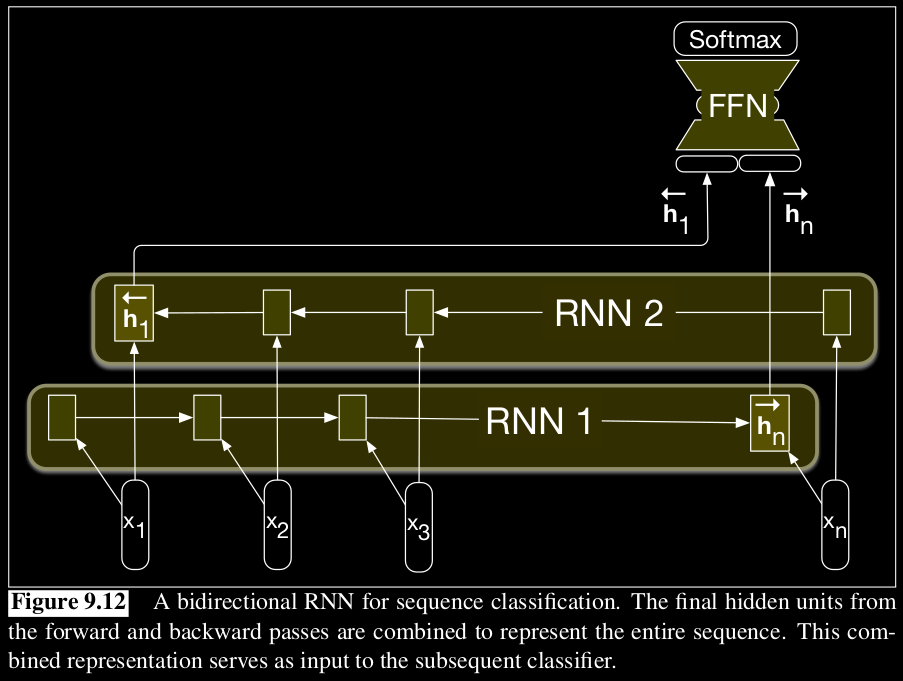

# Bidirectional RNN
A bidirectional RNN combines two independent RNNs, one where the input is processed from the start to the end, and the other from the end to the start. We then concatenate the two representations computed by the networks into a single vector that captures both the left and right contexts of an input at each point in time.

This can be done not just to RNNs, but also GRUs or LSTMs.

