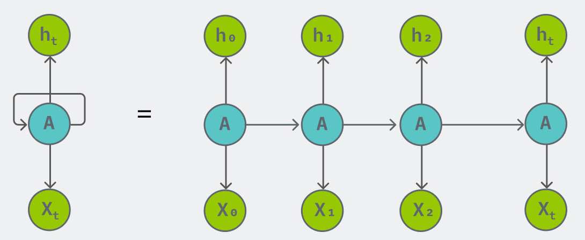
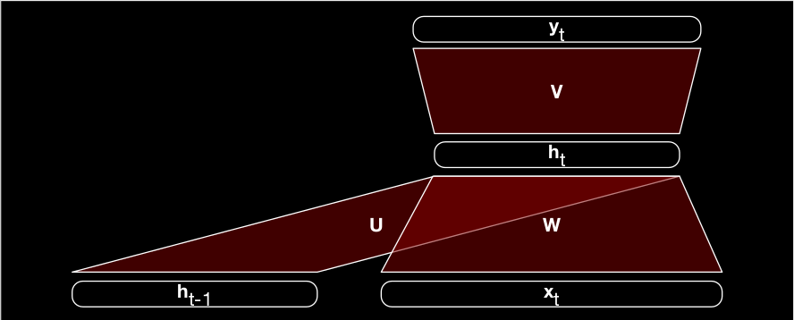
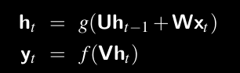
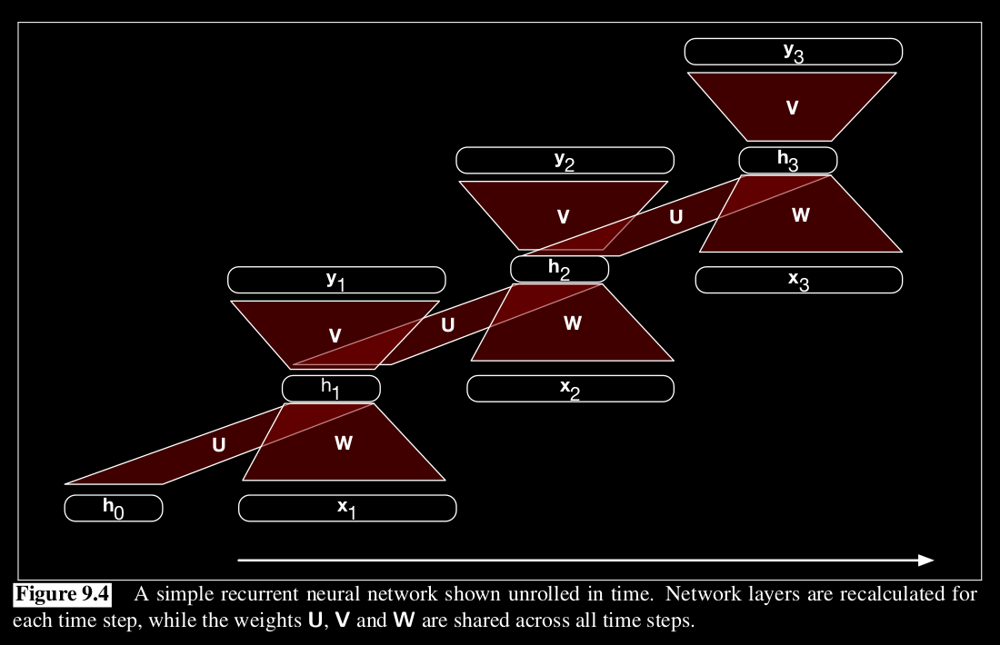
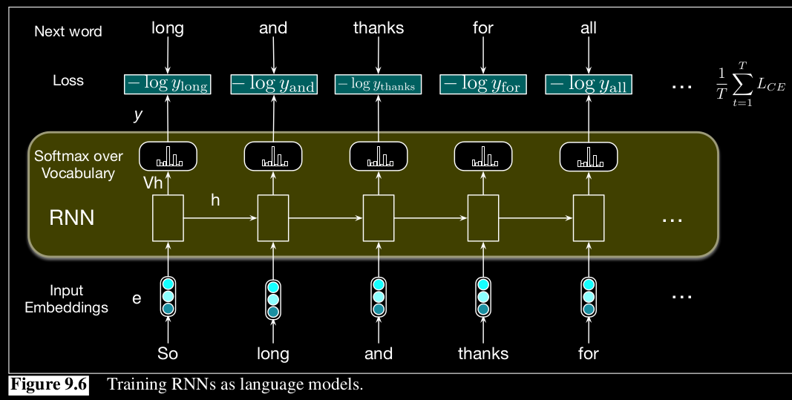

# Recurrent Neural Networks (RNNs)
RNNs are a type of artificial neural network that is designed to recognize patterns in sequences of data, such as text, handwriting, or spoken words. Unlike traditional neural networks, RNNs have loops that allow information to be passed from one step in the sequence to the next. This allows RNNs to maintain a kind of "memory" of previous inputs in the sequence, which they can use to influence their output.

- Because of the loop, RNNs can handle input data of varying length.
- They have a feedback loop present in it - thus RNNs are not feed forward NNs. 
- A problem is that RNNs can only use the previous words when predicting a word - if predicting a word requires a future word, it fails. This can be solved by using a bi-directional RNNs.
- Generally tanh activation functions are used throughout the hidden layers.

# Inference in RNNs
A single layer RNN would look like this.

The next word y, from a word x can be predicted as: 

For eg,

For predicting a word(y1), the RNN takes in the current word(x1) and the hidden state of the previously predicted word(h0) to create the hidden state h1. This is done by matmul h0 with U and x1 with W. Here, U and W are learned parameters from training. Once we have obtained h1, h1 is matmul with V(the weight for next layer). This goes through a softmax, and y1 is obtained. The same this unrolled for predicting each word, as shown above.

# Training RNNs
RNNs use a variation of backpropagation called `Backpropagation Through Time` (BPTT) to update the model's weights and biases.

- We do inference for each word in the text and calculate the loss.
- This loss is used to calculate the gradient for each learnable parameter in the model.
- Then the weights are updated with the gradient.

# Disadvantages of RNNs
- As the length of the input sequence grows, the feature vectors from the beginning of the sequence tend to be “forgotten,” because the state of each unit, which serves as network’s memory, becomes significantly affected by the feature vectors read more recently. The short-term memory limitation of traditional recurrent neural networks is primarily due to the `vanishing gradient` problem.
- Another common problem is `exploding gradients`, where the numbers just blow up to NaNs(infinity).

While the exploding gradients can be easily solved by gradient clipping, vanishing gradients are hard to spot and solve.
