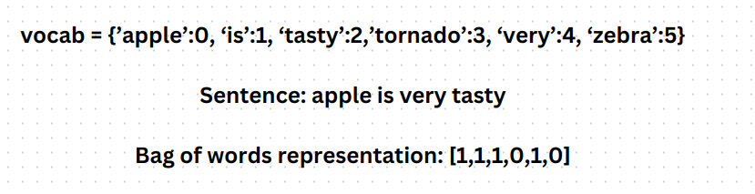
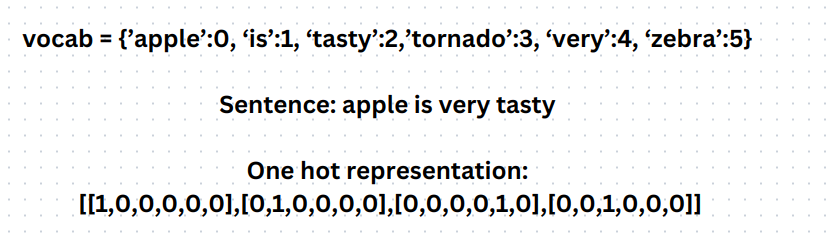

# Representation of Text as numerical vectors

# 1. Statistical  representation
## Bag of words representaion
A vocabulory is formed and an index is allocated to each word. There are two approaches:
1. If the word is present in the sentence, we put 1. Otherwise, we represent the word with 0.
2. We put the word count in the index of the word.
- Gives no context of the sentence.
- It also doesn't take into account of the position of the words

## One-hot word encoding

In a one-hot representation, each word in the vocabulary is uniquely encoded as a `binary vector` where all values are zero except for one, which is set to one. 

- Gives no context of the sentence. This is because the inner product between any two vectors in this representation is zero.
- It also doesn't take into account of the position of the words
  

# 2. Distributional Vector Representation
We use `neural networks` to learn a way to represent words as vectors. Here, we use various features to represent the words.

## Word Embeddings
In Natural Language Processing (NLP), embeddings are vector representations of words or tokens that capture their semantic and syntactic properties. Instead of treating words as discrete symbols, embeddings allow us to manipulate them as continuous vectors in a high-dimensional space, revealing hidden patterns and relationships.

Word embeddings are distributed representations of words in a vector space, where words with similar meanings are represented by similar vectors. These embeddings can be learned by eating up a large corpus of text data.

- It refers to the process of representing categorical data, such as words, as continuous vectors in a lower-dimensional space.
- Visualising this on an n-dimensional graph will reveal that similar items will be grouped together.
- The revolutionary intuition here is that we can just use running text as implicitly supervised training data for such a classifier. This method, often called `self-supervision`, avoids the need for any sort of hand-labeled supervision signal.

## Feature Enginnering
Featurized representations of word embeddings, often referred to as feature engineering, involve extracting or creating additional features from word embeddings to enhance their utility for specific NLP tasks.

## Extracting relationships from word embeddings
Man : Woman  =  King : ?

We can solve this by subtracting embeddings of (Man and Woman) and finding a embedding that gives the similar result with King. We can use cosine similarity to evaluate how aligned two vectors are.

## The embedding Matrix
It is a matrix that contains the word embeddings for all the words in a vocabulary. To get the word embeddings of a word, we matmul the embedding matrix with the one hot encoding vector of the word, whose word embedding is needed.

# Word2vec
`Word2Vec is a specific algorithm for learning word embeddings from a large corpus of text.` It was developed by google. There are two types of word2vec representation:
 - Skip-gram model
 - Continuous bag of words(CBOW)

## 1. Skip gram - a Word2Vec embedding
Skip-gram is a type of word embedding model used in NLP tasks. It aims to capture the semantic relationships between words in continuous vector spaces.

- The skip-gram model is fed a large corpus of text. 
- As the model processes the text, it uses a sliding context window that moves along the text. This context window is like a spotlight that focuses on a small portion of the text at a time.
- At each position where the context window stops, the model selects a single target word from the center of the window. This word is the one the model wants to understand better and create an embedding for.
- The model's goal is to predict the surrounding words within the context window. These surrounding words are referred to as "context words." The model is trained to guess which words are likely to appear in the context of the chosen target word.
- The training process involves adjusting the model's parameters (weights) to maximize the likelihood that it predicts the context words correctly given the target word. In essence, it learns to understand the relationships between words by observing how they co-occur in the training data.
- The result of this training process is a set of word embeddings. These embeddings capture the meaning and context of words based on their co-occurrence patterns in the text.

## 2. Continuous bag of words(CBOW) - a Word2Vec embedding
It is another word2vec embedding just like skip-gram, except we try to predict a word from the surrounding words.

# GloVe (Global vectors for word representations)

GloVe is a another word embedding model that works by learning continuous vector representations for words. 

It aims to capture the semantic relationships between words in a corpus of text by learning vector representations of words based on the co-occurrence statistics of words in the corpus.

- Statistics instead of NNs