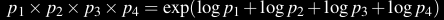
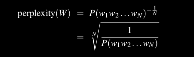

# Sequence Model 
Sequence models are a type of machine learning model used for tasks involving sequences of data, where the order and dependencies between elements in the sequence matter. They are used for natural language processing.

# Language Model
A language model is a type of sequence model that is designed to understand and generate human language. They are computational models that are designed to understand, generate, and process human language in a way that mimics human-like understanding and production. They do this by trying to predict the next word from the previous words(context). 

- The term "large language model" typically refers to language models that have a vast number of parameters and are trained on massive datasets. 

There are two types of language models:
- Statistical
- NN based

## 1. Statistical Language models
Statistical language models are a type of model that use statistical patterns in the data to make predictions about the likelihood of specific sequences of words. A basic approach to building a probabilistic language model is to calculate n-gram probabilities.

An n-gram model is a type of probabilistic language model used in natural language processing and computational linguistics. It predicts the likelihood of a word given the previous (n-1) words. The model calculates the probability of a word occurring based on the frequency of its n-gram in the training data. They estimate the probability of a word given its context using counts of occurrences of words or sequences of words in a training corpus. The probability distribution is calculated based on observed frequencies in the training data.
Eg: bigram(n-gram model with n=2), trigram(n=3), etc.

- We use MLE to estimate the probability of words.
- We always represent and compute language model probabilities in log format as log probabilities. Since probabilities are small numbers, multiplying enough n-grams together would result in numerical underflow. We can just add up the log probabilities, as:

### Markov Assumption
The assumption that the `probability of a word depends only on the previous word` is called a Markov assumption. Markov models are the class of probabilistic models that assume we can predict the probability of some future unit without looking too far into the past.

## 2. Neural network based language models
Neural language models use neural networks to predict the likelihood of a sequence of words. These models are trained on a large corpus of text data and are capable of learning the underlying structure of the language.

They learn complex patterns and representations from large amounts of text data, allowing them to capture long-range dependencies and semantic relationships between words.

Some of the popular architectures to build LLM are:
 - RNN
 - GRU
 - LSTM
 - Transformers

# Evaluating Language models

## Extrinstic
The best way to evaluate the performance of a language model is to embed it in an application and measure how much the application improves. Such end-to-end evaluation is called extrinsic evaluation.

## Intrinstic
Intrinstic ways to evaluate the performance of a language model are:
- Perplexity
- BLEU (Bilingual Evaluation Understudy) score
- ROUGE (Recall-Oriented Understudy for Gisting Evaluation) score
- Word Error Rate (WER)
- F1 score

`An intrinsic improvement in perplexity does not guarantee an extrinsic improvement in the performance of a language processing task` like speech recognition or machine translation. Nonetheless, because perplexity usually correlates with task improvements, it is commonly used as a convenient evaluation metric. Still, when possible a model’s improvement in perplexity should be confirmed by an end-to-end evaluation on a real task.

### 1. Perplexity
The perplexity (sometimes abbreviated as PP or PPL) of a language model on a test set is the inverse probability of the test set (one over the probability of the test set), normalized by the number of words(root is taken of the number of words). For this reason it’s sometimes called the per-word perplexity.

The lower the perplexity of a model on the data, the better the model, and minimizing perplexity is equivalent to maximizing the test set probability according to the language model. It turns out that perplexity can also be thought of as the weighted average branching factor of a language. The branching factor of a language is the number of possible next words that can follow any word.

### 2. Bleu Score

BLEU (Bilingual Evaluation Understudy) is a metric used to evaluate the quality of machine-generated translations, `primarily in the context of machine translation tasks`. 
The BLEU score is a number between 0 and 1, with 1 being a perfect match to the human reference translations. It measures the precision of the machine-generated translation by comparing the n-grams (contiguous sequences of words or characters) in the generated text to those in the reference text. The more n-grams that match, the higher the BLEU score.

It is used in NLP situations where multiple answers can be correct like translation. `Tasks like speech-to-text should not use bleu score, as we always expect a one-on-one correct answer.`

# Dealing with Out Of Vocabulory(OOV) words
One way to create an open vocabulary system is to model potential unknown words in the test set by adding a pseudo-word called `<UNK>`.

# Smoothing
Smoothing algorithms provide a more sophisticated way to estimate the probability of n-grams.

## 1. Laplace Smoothing
The simplest way to do smoothing is to add one to all the n-gram counts, before we normalize them into probabilities. Laplace smoothing does not perform well enough to be used in modern n-gram models, but it gives a useful baseline, and is also a practical smoothing algorithm for other tasks like text classification

## 2. Add-k smoothing
Add a small number like 0.5 or 0.01

## 3. Backoff and Interpolation
Another smoothing technique