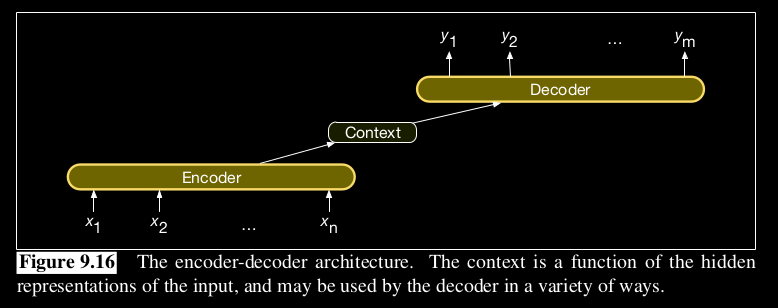
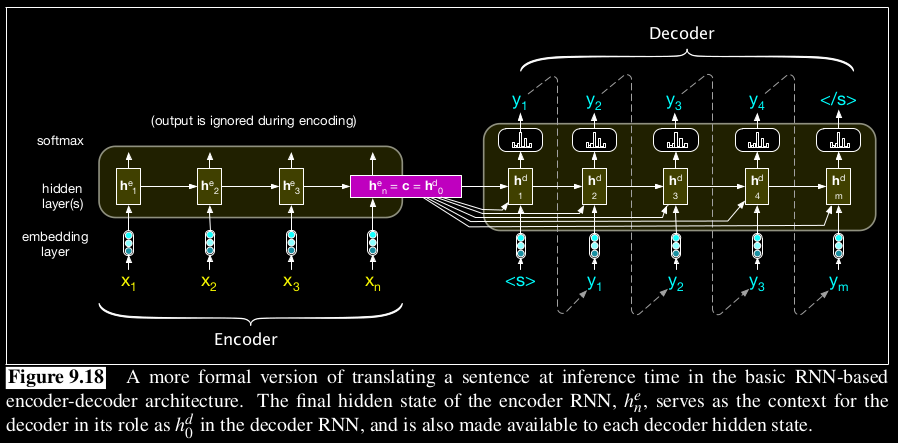

# Encoder-Decoder Model
    Converts input to a fixed length numeric representation(called context), which will be used to compute the result.

The Encoder-Decoder model is a type of neural network architecture consisting of two main components: an encoder and a decoder.

- The `encoder` takes in a sequence of input data, such as a sentence in one language, and maps it to a fixed-length vector representation (often called context). This vector captures the essential meaning of the input sequence and is passed as input to the decoder.
- The `decoder` then generates an output sequence, such as a translation of the input sentence into another language. The decoder uses the vector representation provided by the encoder to generate each element of the output sequence, one at a time, until a stop token is reached.

The following image shows a simplified encoder-decoder model.

The encoder generates the context. The simplest version of the decoder network would takes this state and use it just to initialize the first hidden state of the decoder. The decoder would then autoregressively generates a sequence of outputs, an element at a time, until an end-of-sequence marker is generated. Each hidden state is conditioned on the previous hidden state and the output generated in the previous state.

In this version, the context is given, as a whole, to all of the decoder cell.

# Training
The training data is paired string of the form (source, target).

Forward pass is performed, and loss is calculated for each word. The total loss will be the average of all the individual losses. Then backprop is done. Usually teacher forcing is done during backprop.