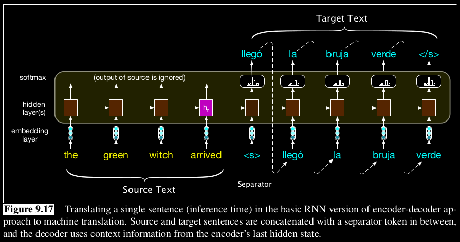

# Encoder-Decoder Model
The Encoder-Decoder model is a type of artificial neural network architecture consisting of two main components: an encoder and a decoder.

- The `encoder` takes in a sequence of input data, such as a sentence in one language, and maps it to a fixed-length vector representation (often called context). This vector captures the essential meaning of the input sequence and is passed as input to the decoder.
- The `decoder` then generates an output sequence, such as a translation of the input sentence into another language. The decoder uses the vector representation provided by the encoder to generate each element of the output sequence, one at a time, until a stop token is reached.

The following image shows a simplified encoder-decoder model.

