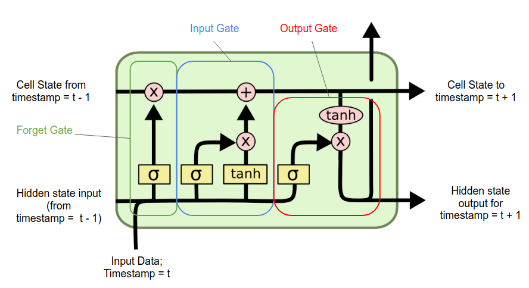

# LSTM (Long Short-Term Memory)
LSTMs are a type of recurrent neural network (RNN) architecture that is capable of learning long-term dependencies, which makes them particularly well-suited for tasks involving sequential data.

- Specifically designed to address both the exploding and vanishing gradient problem.
- LSTMs divide the context management problem into two subproblems: 
  1. Removing information no longer needed from the context
  2. Adding information likely to be needed for later decision making
- This is done with the help of feedforward neural networks, which acts as gates to control the flow of information into the recurrent part.
- LSTM networks have two kinds of memory – short and long term memory. Each LSTM cell has three gates –  `the forget gate, the input gate and the output gate`.
- In practice LSTMs, rather than RNNs, have become the standard unit for any modern system that makes use of recurrent networks.

# Gates
The gates in an LSTM share a common design pattern; each consists of a `feedforward layer`, followed by a `sigmoid activation function`, followed by a `pointwise multiplication with the layer being gated`. The choice of the sigmoid as the activation function arises from its tendency to push its outputs to either 0 or 1. Combining this with a pointwise multiplication has an effect similar to that of a binary mask. Values in the layer being gated that align with values near 1 in the mask are passed through nearly unchanged; values corresponding to lower values are essentially erased.

### Forget gate
The purpose of this gate is to delete information from the long term memory that is no longer needed.

The forget gate takes in the weighted sum of the input vector from (t)th and (t-1)th state, and pass them through a sigmoid function. This gives an output between 0 and 1, which will be multiplied with the long term memory. 

### Input gate/ Add gate
It inserts new information from the current input to the long term memory. 

It takes in the weighted sum of the input vector from (t)th and (t-1)th state, and pass them through a sigmoid function and a tanh function. Then those two values are multiplied and added to the long term memory.

### Output gate
It gives out the output, derived from the input, long and short term memory which is to be passed to the next cell (or looped back in). 

It takes in the weighted sum of the input and short term memory and multiplies it with the tanh of the long term memory. This is the output, which is given out, as the short term memory of the next cell(or looped back in) and the y output from the cell.  

Read later: http://colah.github.io/posts/2015-08-Understanding-LSTMs/