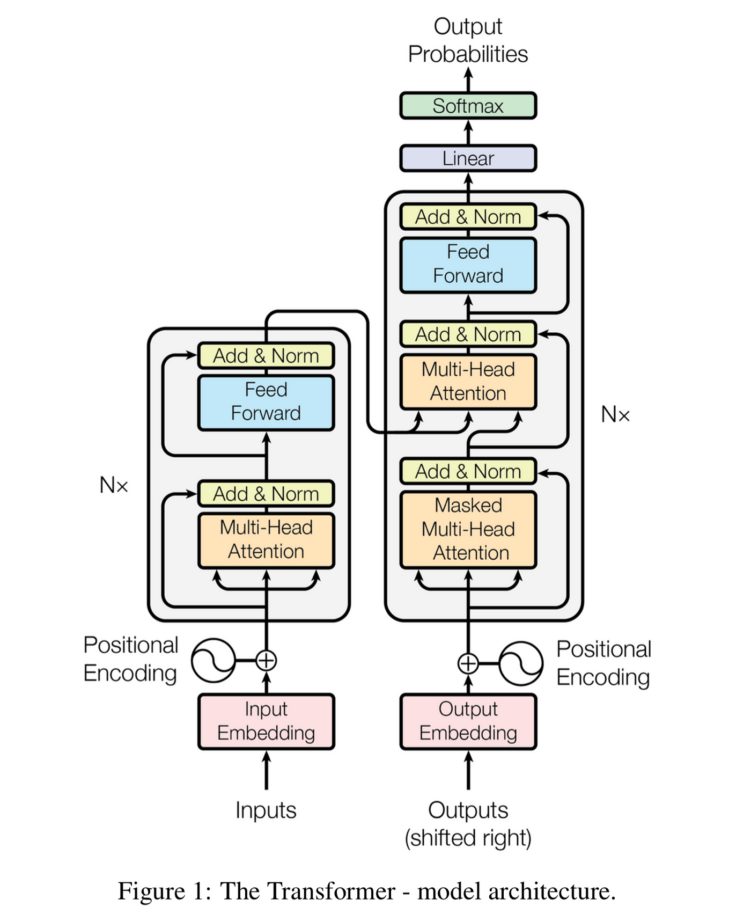

# Transformers
Transformers, a revolutionary neural network architecture, introduce a `self-attention mechanism` that enables the model to weigh the importance of different elements in a sequence dynamically Incorporating `positional embedding`, transformers capture the sequential order of input data. The architecture comprises an `encoder-decoder structure`, where the encoder processes input information, and the decoder generates output. `Multi-head attention` enhances the model's ability to capture diverse relationships by employing parallel attention mechanisms. `Layer normalization` and `residual connections` contribute to stable and effective training. Feedforward neural networks further refine information extracted through attention mechanisms. 



## Advantages of Transformers (over RNNs) 
- Parallel computation -> faster
- Higher context -> better performance

## Self Attention
The key innovation of transformers is their self-attention mechanism, which enables transformers to `capture long-range dependencies in data`, making them well-suited for tasks involving sequences.

Self-attention is a mechanism in NLP models that `allows the model to consider the context(the words around that word) of a word in a sentence when encoding it as a numeric vector.` During self-attention, the model computes a weighted sum of the embeddings of all the words in a sentence, where the weights are determined by the attention scores assigned to each word. These attention scores reflect the importance of each word in the context of the current word being encoded. Thus the embedding for each word is calculated dynamically with the help of the words around it.

# Query, Key, Value system for attention
The Query, Key, Value (QKV) system is a fundamental component of the attention mechanism used in transformers. In this system, when processing a sequence of input data, each element (e.g., word) is associated with three vectors: a Query vector (Q), a Key vector (K), and a Value vector (V). Here's a brief overview of their roles:

1. Query (Q): This vector represents the `element that is used to inquire about the other elements in the sequence`. In the context of attention mechanisms, the query is used to calculate the attention scores indicating how much focus each element should receive. This is obtained from the generated part of the output.
   
2. Key (K): The key vector is associated with the element being considered for attention. The key helps `determine the relevance of this element to the query`. `The dot product of the query and key vectors is used to calculate the attention scores`.

3. Value (V): The value vector contains `information about the element being considered`. The attention scores (derived from the query-key interaction) are used to weight the values. The final weighted sum of values forms the output of the attention mechanism for that particular element.
   
``` A = softmax(Q @ K.T) @ V ```

    The query looks at the already generated part of the output and asks a question. This is matmul-ed with the query value to generate a matrix. A higher value on this matrix means more attention. This matrix is matmul-ed with the value vector to get a one dimensional vector that marks the attention to be given to each word in the input for that particular query.

The QKV system is crucial in the attention mechanism's ability to `selectively focus on different parts of the input sequence`, allowing transformers to capture complex relationships and dependencies within the data. 

## Multi-headed attention
`The QKV mechanism is typically used in multiple heads, in parallel, to enhance the model's capacity to learn diverse patterns and representations.`
At each head, a different query is asked. 

For eg: 

To translate: `Jane visits Africa in September.`
- Query1: Do what with Africa?  # High attention to visits
- Query2: When visit Africa?  # High attention to September
- Query3: Who visits Africa?  # Jane
- Query4: Where does Jane visit?  # Africa
- . . . h heads
  


In theory, `each head will learn something different, giving the model better representation power.`The concatenation of the representation of all the heads is used for final prediction.

# The transformer Architecture
The most basic part of the transformers is shown here:


In short,transformer architecture can be summarised as:

    1. Input Representation: Convert input words into vectors (embeddings).

    2. Positional Encoding:
        Add Positional Information: Since Transformers don't inherently understand the order of words in a sequence, positional encodings are added to the input embeddings to give the model information about the position of each word.

    3. Encoder: The input sequence is passed through multiple identical layers of the encoder. The first few layers will pick up the raw properties of the sentence, while the later layers will pick up more complex properties. 
    Each encoder layer has two sub-layers:

        - Self-Attention Layer: Allows the model to weigh different parts of the input sequence differently when making predictions.
        - Feedforward Neural Network: Applies a set of transformations to the outputs of the self-attention layer.
        The output from the encoder is a numerical representation of the the input, with attention information. This lets the decoder focus on relevant information. 

    4. Decoder: Similar to the encoder but with an additional layer:
        - Self attention layer        - 
        - Masked Self-Attention (Encoder-Decoder attention)layer: Ensures that each position in the decoder can only attend to positions before it. This prevents information flow from future tokens during training.
        - Feed forward NN layer
    
    5. Attention Mechanism:
        - Scaled Dot-Product Attention: Calculates attention scores by taking a weighted sum of values, where the weights are determined by the compatibility (dot product) between a query and keys.

    6. Layer Normalization and Residual Connections:
        - Normalization: Each sub-layer output is normalized to stabilize and speed up training.
        - Residual Connections: Original inputs to a sub-layer are combined with its output, helping with the flow of gradients during training.

    7. Multi-Head Attention:
        - Parallel Attention Mechanisms: The attention mechanism is applied multiple times in parallel, each with different learned weights. The outputs are then concatenated and linearly transformed.
    
    8. Final Linear and Softmax Layers:
    The output of the decoder is transformed into the final output vocabulary size through a linear layer. Softmax is applied to get probabilities.


There are certain things that can vastly improve the performance of transformer models

## 1. Positional Encodings
The position of the words can play a major role in its meaning. So we encode the postion of the words also. This will shift the word in the vector space along a particular dimension, closer to other words with the same index. This will let the model have a better understanding of the context. This shift should not be too large, or else the positional similarity will overwrite the semantics similarity with other words.So, we encode the position as sine and cosine waves.


## 2. Residual Networks
Just like resnet, we create connections that add earlier part of the network to the later parts. This will vastly improve transformer's ability to remember context for a longer period of time.

## 3. Batch normalisation
For faster convergence.

# Walkthrough

1. Takes in the tokenised words as input
2. Goal of the encoder is to provide a VERY good representation of the input text. We add positional embedding to give positional information, and self-attention to generate embedding for each word wrt the word's context.


