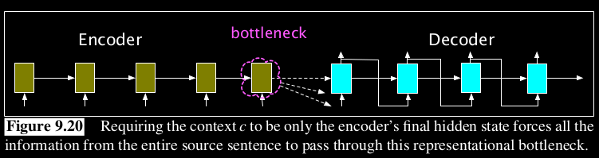
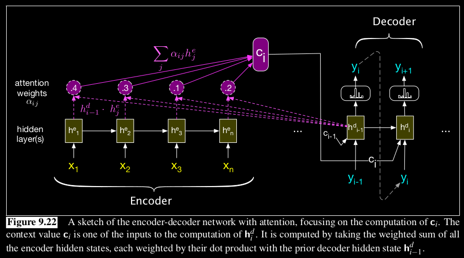

# Need for Attention
In a normal encoder-decoder setup, the context must represent absolutely everything about the meaning of the source text as it is the only thing given to the decoder. Thus this hidden state will often act as the bottleneck. All the information (especially from the beginning of the text) will not be represented well.

The attention mechanism is a solution to the bottleneck problem - `a way of allowing the decoder to get information from all the hidden states of the encoder, not just the last hidden state.`

# Attention
The concept of attention involves generating a single fixed-length vector(context) for each token in the decoder, which is obtained by computing a weighted sum of all encoder hidden states. The weights applied during this process determine the focus or attention on a specific portion of the source text that is most associated with the token being produced by the decoder at any given time. In contrast to the static context vector, `attention provides a dynamic vector that is derived from the encoder hidden states, with a unique version calculated for each decoding token.`

## Dot-product attention
It is the most simple attention mechanism. It implements attention as by measuring how similar the decoder hidden state is to an encoder hidden state, by computing the dot product between them.The score that results from this dot product is a scalar that reflects the degree of similarity between the two vectors.

# Learning attention using Neural Networks
Another way to calculate attention is to define a set of weights, which learns during training about how to give attention for each of the encoder tokens, given a decoder token. This is superior to the dot product attention mechanism.

## Attention:
- Basic Idea: `Attention mechanisms allow a model to focus on different parts of the encoder sequence when processing a particular element in the decoder part.`

## Self-Attention (or Intra-Attention):
- Basic Idea: `Self-attention is a specific type of attention where the elements of the endoder sequence attend to each other. It is used in transformers.`