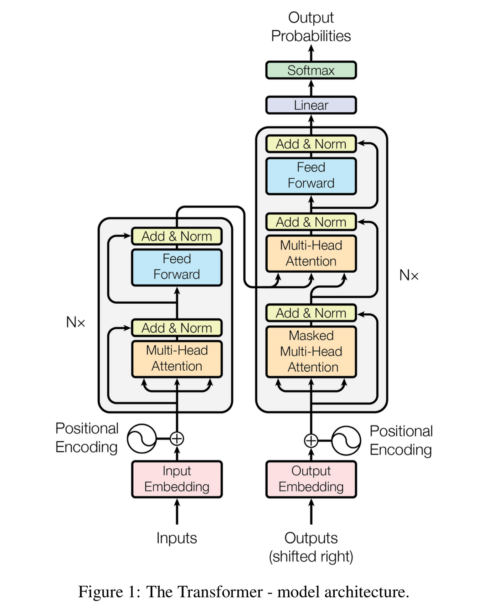

# Transformers
Transformers, a revolutionary neural network architecture, introduce `self-attention mechanism` that enables the model to weigh the importance of different elements in a sequence dynamically Incorporating `positional embedding`, transformers capture the sequential order of input data. The architecture comprises an `encoder-decoder structure`, where the encoder processes input information, and the decoder generates output. `Multi-head attention` enhances the model's ability to capture diverse relationships by employing parallel attention mechanisms. `Layer normalization` and `residual connections` contribute to stable and effective training. Feedforward neural networks further refine information extracted through attention mechanisms. 

## Use cases
- It was initially used to process text data
- Now it is extended to perform on all kinds of data, even images.

## Advantages of Transformers (over RNNs and other sequential models) 
- Parallel computation -> faster
- Higher context -> handles bigger data 
- Better understanding -> better quality

# The Transformers Architecture
- Input text is tokenized by methods like Byte Pair Encoding
- It has an encoder decoder architecture
- Positional encoding
- The context of the input is captured using self attention mechanism with QKV system
- The self-attention is performed parallelly in multiple heads (multi-head attention)
- The feed forward layers helps processes the outputs of the self-attention layer independently for each position in the sequence
- Masking is done during the training
- Further optimisation for stability and performance
- Layer normalisation
- Residual connections
  


# 1. Self Attention
(It is used to update embedding of input words, inorder to include the context. It is done in multiple heads as Q, K, V system.)

The key innovation of transformers is their self-attention mechanism, which enables transformers to `capture long-range dependencies in data`, making them well-suited for tasks involving sequences. It is a mechanism that `update the embedding of input words inorder to allows the model to consider the context(the words around that word) of a word in a sentence when encoding it as a numeric vector.` 

During self-attention, the model computes a weighted sum of the embeddings of all the words in a sentence, where the weights are determined by the attention scores assigned to each word. These attention scores reflect the importance of each word in the context of the current word being encoded. Thus the embedding for each word is calculated dynamically with the help of the words around it.

- Each input word is vectorised using techniques like word2vec. Thus the word would be rich in context but will lack contextual information.
- This goes into the seqence of encoder blocks, which will use the QKV system to add this context meaning.

## Query, Key, Value system for self-attention
(The below things happen in one head of the multi-head attention. More about it below.)

`Each token in the input will be associated with a Q,K and V vectors.` They are all stored in the Q, K, V matrix of that head. These matrices are trainable parameters used to update each of the word embedding with the contextual information. 

Queries, Keys and value vectors are obtained by multiplying the query, key and value matrix with the embedding of the corresponding token.

Consider the sentence: `Jane visits Africa in September.`

1. Query (Q): This vector represents the `asks a question to every other tokens in the context`. The query may ask 'Who visits?'. (Each head of the multi-head asks different question.)
   
2. Key (K): The key vector `answers the question asked by the query vector`. The key vector that is closest to the query vector will be given more attention. The dot product of the query and key vectors is used to calculate the attention scores.

3. Value (V): The value vector contains `information about the token being considered`. The attention scores (derived from the query-key interaction) are used to weight the values. The final weighted sum of values forms the output of the attention mechanism for that particular element. 

``` A = softmax((Q @ K.T)/sqrt(dim(Q))) @ V ```

`This weighted sum is added to the previous embedding of the words to get the context-added embedding vectors.` This will give the embedding contextual meaning regarding the query asked. (This is done with various queries, in parallel, in multiple heads.)
   
The QKV system is crucial in the attention mechanism's ability to `selectively focus on different parts of the input sequence`, allowing transformers to capture complex relationships and dependencies within the data. 

Internally, this is how Q, K and V are obtained from input X. After multihead attention, all the heads are added up and is projected to a different dimension.


# 2. Multi-headed attention
`The QKV mechanism is typically used in multiple heads, in parallel, to enhance the model's capacity to learn diverse patterns and representations.`Each head have a separate Q, K and V matrix(obtained by training). 

Essentially, each head asks a different query. The weighted attention score with the value will be added to the embedding. Each head will learn something different, giving the model better representation power.

To translate: `Jane visits Africa in September.`
- Query1: Do what with Africa?  # High attention to visits
- Query2: When visit Africa?  # High attention to September
- Query3: Who visits Africa?  # Jane
- Query4: Where does Jane visit?  # Africa
- . . . h heads

# 3. Positional Embedding:
(This happens right after converting the text to its embedding, before self-attention.)

Since Transformers don't inherently understand the order of words in a sequence, positional encodings are added to the input embeddings to give the model information about the position of each word. An additional dimension will be added to the embedding which will represent the position. This is called positional embedding.

# 4. Encoder decoder Architecture
(I dont talk about Layer normalisation and Residual connections here to focus on the encoder-decoder part.)

### Encoder
As shown in the image, the input(positional embedding) goes into a sequence of N encoders. These encoders do multi-head attention and pass the output through feed-forward neural networks. All of these will give a pretty good representation of the input text. 

### Decoder
The output text(which would be < start > token in the beginning, and gets updated as the decoder generates more tokens) is passed into a masked-multi-head-attention layer. Here, self attention happens for the current token with every past tokens(future tokens are masked off), and embedding is created.

The query and key from the encoder generated embedding and value from decoder generated embedding is bought together in the next self attention layer. `Here, the input embedding is used to provide attention to nomalised output embedding.` The output from this goes to a feed forward layer.

### Softmax layer (Transformer head)
The output of the decoder goes to a linear layer, and then into a softmax layer, which gives out the probability of the next token. A token is selected and goes into the beginning of the decoder for generating the next token. This goes on till < stop > token is generated from the decoder.

Before it goes into the softmax layer,

# 5. Layer Normalization and Residual Connections:
Both of these make transformers stable and increases its performance.
- `Layer Normalization`: Each sub-layer output is normalized to stabilize and speed up training.
- `Residual Connections`: Original inputs to a sub-layer are combined with its output, helping with the flow of gradients during training.
