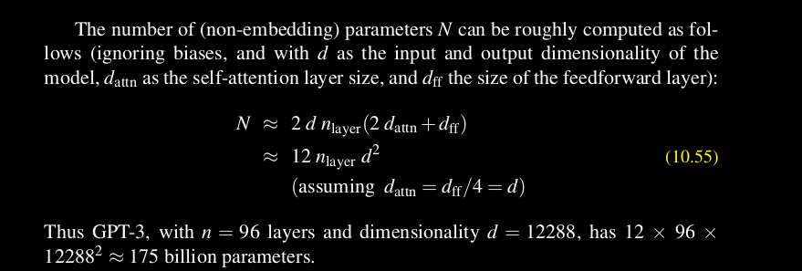

# Training transformers

To train transformers, we use the `self-supervised learning` algorithm. A large text corpus is given to the model, and the model will predict each token on it, with the help of the previous token. It is an unsupervised learning technique(but very close to supervised), that will let the transformers learn about the underlying pattern from the text.

In self supervised learning, there is no ultimate answer - no golden labels. We simply train the model to minimize the error in predicting the true next word in the training sequence, using cross-entropy as the loss function.

We use technique like teacher forcing or professor forcing for training, to prevent the model from going off to wrong routes. For transformers, this self supervised learning can be done in parallel if we use teacher forcing.

The quality of a model after training depends on these three factors:
- The model non-embedding parameter size(and architecture)
- The dataset size(and quality)
- The compute power

