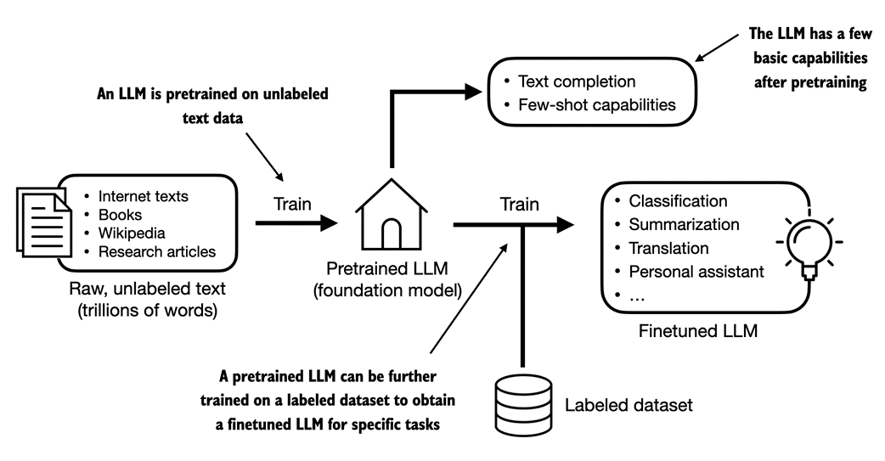

# Large Language Model

LLM stands for Large Language Model. It's a type of artificial intelligence (AI) model that is trained on a massive dataset of text to generate human-like language understanding and generation capabilities.

BERT and GPT are some good examples for LLMs. BERT is really good at masked word prediction and sequence classification tasks, while GPT is really good at autoregressive text generation.

- `BERT is encoder only model.` Encoder-only models are typically used for tasks that require extracting meaningful representations from input sequences, without generating text.

- `GPT is a decoder only model.` Decoder-only models are typically designed for autoregressive generation tasks, such as language modeling, text generation, and machine translation.
    

## Training an LLM
Training an LLM typically occur in two phases-
1. Pretraining 
2. Finetuning

