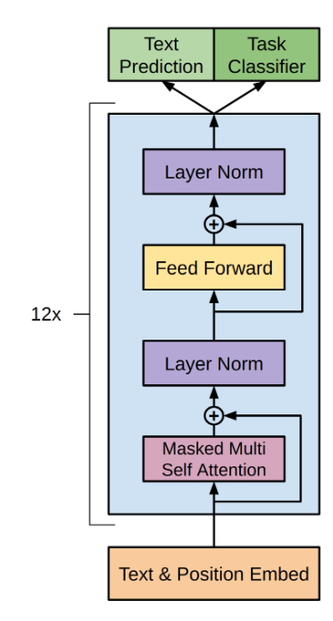

# Improving Language Understanding by Generative Pre-Training
###### by Alec Radford, Karthik Narasimhan, Tim Salimans,  Ilya Sutskever

Paper available at: https://cdn.openai.com/research-covers/language-unsupervised/language_understanding_paper.pdf

This paper introduces the common approach of two step LLM training - pretraining(on large unlabelled text via self-supervised learning) and fine tuning(on a smaller, labelled and cleaner dataset, often on a particular domain via supervised learning). Nowadays, this approach has become the golden standard for LLM training.

# GPT
GPT is used for autoregressive text generation. It is a decoder only model, with the following architecture.

The authors trained a 12-layer decoder-only transformer with masked self-attention heads. By pre-training on a diverse corpus with long stretches of contiguous text the model acquires significant world knowledge and ability to process long-range dependencies which are then successfully transferred to solving discriminative tasks such as question answering, semantic similarity assessment, entailment determination, and text classification, improving the state of the art on 9 of the 12 datasets they studied.

GPT-3 leverages from the same architecture, but has access to larger and cleaner data and a higher number of learnable parameters. This makes them better.