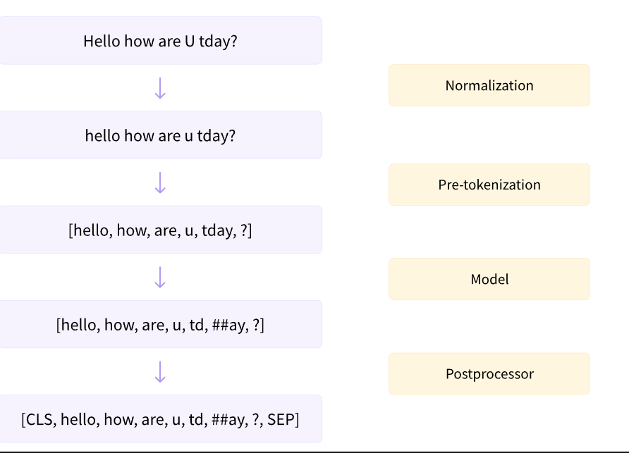
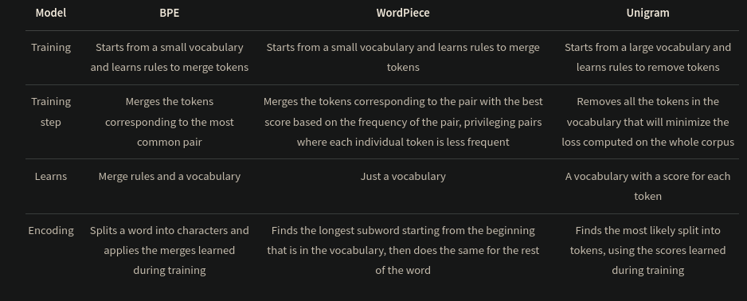

# Tokenizers
Tokenizers convert text(or pretty much any form of data) into tokens, which can be easily used by the model.



# Basic Tokenization Algorithm - SentencePiece
SentencePiece is an unsupervised text tokenizer and detokenizer primarily used in Natural Language Processing (NLP) tasks. 
It converts text into subwords or tokens for model training and inference. 
Developed by Google, it is a language-agnostic, character-level tokenizer and can handle texts without relying on predefined vocabulary or language-specific rules.

Common subword tokenizers in transformers are:
- Byte-Pair Encoding [BPE]
- WordPiece
- Unigram



# Byte-Pair Encoding tokenization
Byte-Pair Encoding (BPE) was initially developed as an algorithm to compress texts, and then used by OpenAI for tokenization when pretraining the GPT model.

BPE training starts by computing the unique set of words used in the corpus (after the normalization and pre-tokenization steps are completed), then building the vocabulary by taking all the symbols used to write those words.

#### Developing tokenizer
- First, we will have a very basic character level vocabulory
- As we add more training data, the vocabulory increses by merging vocabulory
- At the beginning these merges will create tokens with two characters into longer subwords.
- At any step during the tokenizer training, the BPE algorithm will search for the most frequent pair of existing tokens. That most frequent pair is the one that will be merged, and we rinse and repeat for the next step.

# WordPiece tokenization
WordPiece is the tokenization algorithm Google developed to pretrain BERT. 
Never open sourced.

#### Developing tokenizer
- Starts from a small vocabulory like BPE, and gets big by merging
-  The main difference is the way the pair to be merged is selected. Instead of selecting the most frequent pair, WordPiece computes a score for each pair, using the following formula:
```score = (freq_of_pair)/(freq_of_first_element×freq_of_second_element)```
- By dividing the frequency of the pair by the product of the frequencies of each of its parts, the algorithm prioritizes the merging of pairs where the individual parts are less frequent in the vocabulary
- Tokenization differs in WordPiece and BPE in that WordPiece only saves the final vocabulary, not the merge rules learned.

# Unigram tokenization
It is primarily employed in tools like SentencePiece to generate a vocabulary that optimally represents the text corpus by minimizing the total encoding cost.

#### Developing tokenizer
- It starts from a big vocabulary and removes tokens from it until it reaches the desired vocabulary size
- At each step of the training, the Unigram algorithm computes a loss over the corpus given the current vocabulary.
- Then, for each symbol in the vocabulary, the algorithm computes how much the overall loss would increase if the symbol was removed, and looks for the symbols that would increase it the least.
- Those symbols have a lower effect on the overall loss over the corpus, so in a sense they are “less needed” and are the best candidates for removal.
- This process is then repeated until the vocabulary has reached the desired size.
- Note that we never remove the base characters, to make sure any word can be tokenized.

## Reference
https://huggingface.co/learn/nlp-course/chapter6/1?fw=pt