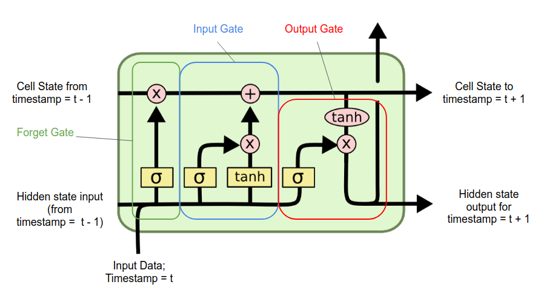

# Modifications to RNN s

## 2. LSTM 
Long Short-Term Memory networks were specifically designed to address both the exploding and vanishing gradient problems as well as the long-term dependencies issue, making them a significant improvement over vanilla RNNs in these aspects.

LSTM networks have two kinds of memory – short and long term memory. Each LSTM cell has three gates –  the forget gate, the input gate and the output gate.

In each gate, the sigmoid activation function determines how much of the data is to be remembered.

### Forget gate
This gate decides how much of the data is to be remembered in the long term memory. The forget gate takes in the weighted sum of the input vector from (t)th and (t-1)th state, and pass them through a sigmoid function. This gives an output between 0 and 1, which will be multiplied with the long term memory. 

### Input gate
It inserts new memory to the long term memory. It takes in the weighted sum of the input vector from tth and (t-1)th state, and pass them through a sigmoid function and a tanh function. Then those two values are multiplied and added to the long term memory.

### Output gate
It gives out the output, derived from the input, long and short term memory which is to be passed to the next cell (or looped back in). It takes in the weighted sum of the input and short term memory and multiplies it with the tanh of the long term memory. This is the output, which is given out, as the short term memory of the next cell(or looped back in) and the y output from the cell.  

 
Read later: http://colah.github.io/posts/2015-08-Understanding-LSTMs/

## 3. Gated Recurrent Unit

GRU (Gated Recurrent Unit) is a type of RNN architecture used in the field of NLP, designed to address some of the limitations of traditional RNNs, such as the vanishing gradient problem and the difficulty of capturing long-range dependencies in sequences.
GRUs help RNNs capture and remember important information, by having a memory of the past while also allowing them to adapt to new data as it comes in. `GRUs are actually a simplified LSTM model.`

## 5. Deep RNNs
Instead of recurring over a cell, we can recurr over a small NN. This creates deep RNNs.

