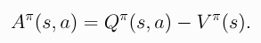

# Reinforcement Learning 
`Reinforcement learning (RL) is a type of machine learning paradigm where an agent learns how to behave in an environment by performing actions and receiving feedback in the form of rewards or punishments.` 
- The goal of the agent is to maximize the cumulative reward over time by discovering a strategy, or policy, that maps from states of the environment to actions.
- You have an agent interacting with the environment. It makes some actions and the environment sends back the reward for that particular action and also the next state of the environment.
- In RL, we don't think in terms of 'good' actions. An action is considered 'good' if it is a part of a good policy (sequence of actions that lead to the goal state).
- The Markov Decision Process is the mathematical model or the problem formulation that contains things like state, action, transition, etc. It's the blueprint or the formal definition of the sequential decision-making challenge.RL is the solution methodology or the set of algorithms to solve MDPs, particularly when the complete dynamics (P and R) are unknown, by learning through interaction.

## Key components:
- **Agent**: The AI or algorithm that learns and makes decisions.
- **Environment**: The world or system the agent interacts with. No information is hidden in this description.
- **Observation**: The information the agent receives from the environment. It can be the full state or a partial observation of the state.
- **State** (S): A snapshot of the environment which is given to the agent. It is a function of the history of the environment and the agent's actions. It is generally represented as a vector or matrix.
- **Action** (A): A choice the agent can make in a given state.
- **Action Spaces** - The set of all possible actions the agent can take. It can be discrete (a finite set of actions) or continuous (an infinite set of actions). There are families of RL algorithms that will work only with one type of action space.
- **Policy** (π): The agent's strategy or "brain." It's a function from states to actions – what action the agent should take in a particular state. The goal of RL is to find the optimal policy. It can be deterministic (always the same action for a state) or stochastic (probabilistic action selection, ie, gives the probability for taking each action, given a state).
- **Episode**: A sequence of states, actions, and rewards that ends in a terminal state .
- **Reward** (R): Feedback from the environment. This tells the agent how good or bad its last action was in that state.
- **Return**: The total accumulated reward from a state until the end of an episode, discounted by a factor γ. It is one sample of the different possiblities from MDP.
- **Value Function**: Predicts the expected future reward an agent can get from being in a particular state (V) or from taking a particular action in a particular state (Q). This helps the agent make long-term plans. RL agents which use these are called value-based agents.
    - **Q-value (Action-Value Function):** $Q(s, a)$ tells us the amount of reward we can expect starting from a specific state $s$ and picking a specific action $a$, and then following a particular policy thereafter. Finding the optimal q-value is the ultimate goal of RL.
    - **V-value (State-Value Function):** $V(s)$ tells us the amount of reward we can expect starting from a specific state $s$, and then following a particular policy thereafter. The optimal policy is found by selecting actions that have the highest Q-value for each state.
    - **Difference:** The Q-value takes into account an action taken (which may not be in the policy) and the state(and then the policy thereafter), while the V-value only considers the state(and then the policy thereafter). The V-value is the expected value over all possible actions in the state, weighted by the policy's probability of choosing each action.
- **Advantage Functions:** It is the difference between the Q-value and the V-value. It measures how much better a particular action is compared to the average action at that state under the current policy.

## Important Concepts:
- **Exploration vs. Exploitation**: The agent must balance exploring new actions to discover their rewards (exploration) and using known actions that yield high rewards (exploitation). This is a fundamental trade-off in RL.
- **Discount Factor (γ)**: A value between 0 and 1 (generally between 0.9 and 0.99) that determines the importance of future rewards. A higher γ means the agent values future rewards more, while a lower γ focuses on immediate rewards.`The value of reward R after k steps is (γ^k)R`.
- **Markov Decision Process (MDP)**: A mathematical framework for modeling decision-making, consisting of states, actions, rewards, and transition probabilities. It provides a formal structure for RL problems. The name Markov Decision Process refers to the fact that the system obeys the Markov property. An MDP is defined as a 5-tuple, `< S, A, R, P, ρ >`, where
    - S is the set of all valid states,
    - A is the set of all valid actions,
    - R is the reward function
    - P is the transition probability function
    - ρ(rho) is the starting state distribution. It tells us how likely it is to start in each state at the very beginning of each episode.
- **Markov Property:** Transitions only depend on the most recent state and action, and no prior history.
- **Bellman Equation** provide a set of recursive relationships that `define the value functions` (𝑉(𝑠)V(s) for state-value and 𝑄(𝑠,𝑎)Q(s,a) for action-value) in terms of the values of successor states. It state that `The value of your starting point is the reward you expect to get from being there, plus the value of wherever you land next.`
