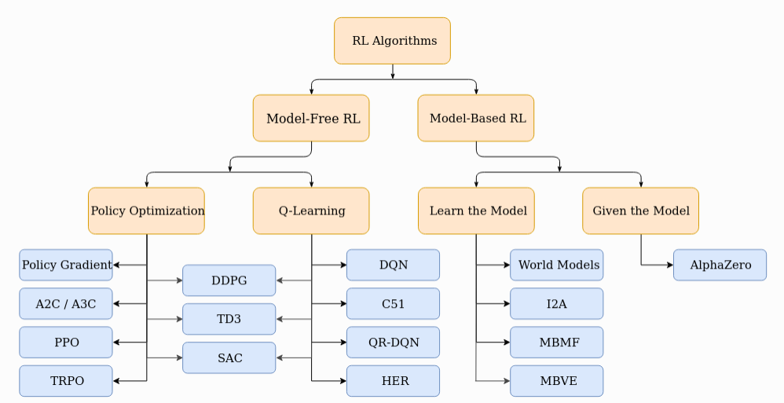
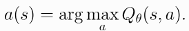

# Classification of RL Algorithms

In the highest level, we can classify RL algorithms into two main categories: Model-based and Model-free.
## Model-based RL
Model-based RL algorithms build a model of the environment and use it to make decisions. They can plan ahead by simulating future states and actions, which allows them to make more informed decisions. A model is nothing but a function that predicts state transitions and rewards. They are generally more sample efficient because they can learn from fewer interactions with the environment.

## Model-free RL
Model-free RL algorithms do not build a model of the environment. Instead, they learn directly from the interactions with the environment. They can be further classified into two main categories: Value-based and Policy-based.

### Value-based RL/Q-learning
- They try to approximate the optimal action-value function (Q-value) or state-value function (V-value) using a value function.
- The agent then selects actions based on these values. The most common value-based RL algorithm is Q-learning, which learns the Q-value function.
- Optimisation processes are generally off-policy, meaning that the agent can learn from data collected by a different policy than the one it is currently following.

- Examples of value-based RL algorithms include Q-learning, Deep Q-Networks (DQN), C51, and SARSA.

### Policy-based RL/ Policy Optimization
- Policy-based RL algorithms learn a policy directly, without estimating the value function. 
- They optimize the policy(generally neural networks) by maximizing the expected cumulative reward. This is often done using gradient ascent methods, where the policy is updated in the direction of the gradient of the expected reward with respect to the policy parameters.
-  This optimization is almost always performed on-policy, which means that each update only uses data collected while acting according to the most recent version of the policy. 
- These algorithms can handle high-dimensional action spaces and are often used in continuous action environments. Examples include REINFORCE, A2C and Proximal Policy Optimization (PPO).