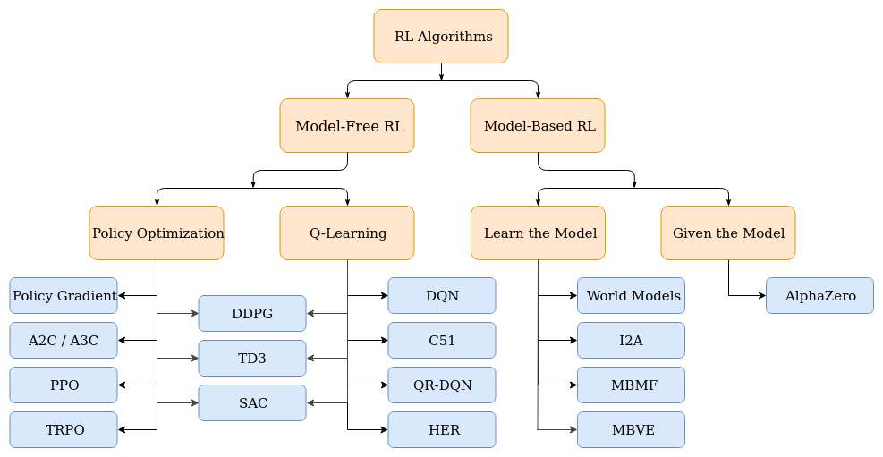

# Classification of RL Algorithms

# Best RL Algorithms
1. PPO (Proximal Policy Optimization):
    - What it is: A policy gradient algorithm that updates the policy in small, stable steps.
    - Why it's important: Known for its balance of performance, stability, and relative ease of implementation/tuning. It's often the default choice for many tasks.
    - Best for: General-purpose use, works well for both continuous and discrete action spaces.
2. SAC (Soft Actor-Critic):
    - What it is: An off-policy actor-critic algorithm that incorporates entropy maximization into its objective.
    - Why it's important: Currently one of the state-of-the-art algorithms, particularly for continuous control, known for high performance and good sample efficiency.
    - Best for: Continuous control tasks where achieving peak performance and robust exploration are key.
3. TD3 (Twin Delayed Deep Deterministic Policy Gradient):
    - What it is: An off-policy actor-critic algorithm that improves upon DDPG by using twin critics and delayed policy updates.
    - Why it's important: A strong alternative to SAC for continuous control, specifically designed to combat issues like Q-value overestimation, leading to more stable training than its predecessor.
    - Best for: Continuous control tasks, especially if stability is a concern.
4. DQN (and its variants):
    - What it is: A value-based algorithm that uses a deep neural network to approximate the Q-function. Variants like Double DQN, Dueling DQN, and Prioritized Experience Replay add significant improvements.
    - Why it's important: The foundational deep RL algorithm for discrete action spaces. Its modern variants are state-of-the-art for problems like playing Atari games.
    - Best for: Environments with discrete action spaces.
5. Model-Based RL (e.g., MBPO - Model-Based Policy Optimization):
    - What it is: A class of algorithms that learn a model of the environment's dynamics and use this model to plan or generate synthetic data for training.
    - Why it's important: Can be significantly more sample-efficient than model-free methods, requiring less interaction with the real environment.
    - Best for: Scenarios where interacting with the environment is expensive or slow (e.g., real-world robotics).

