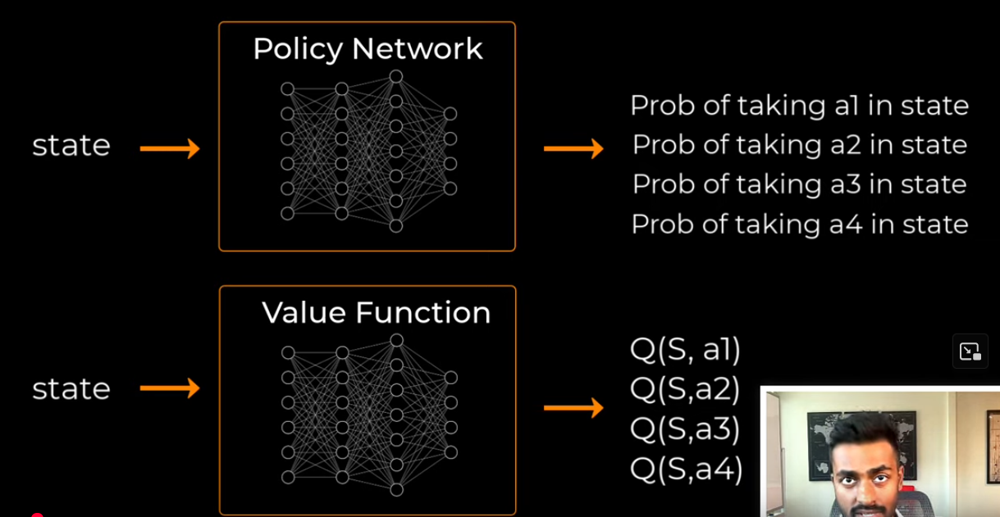
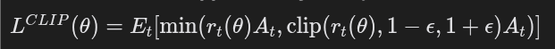
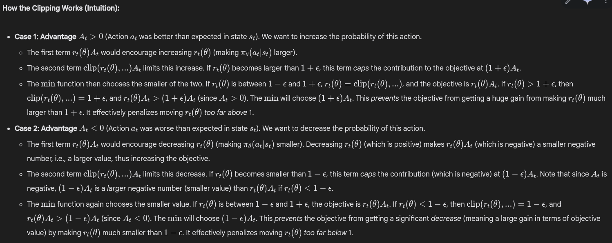

# Proximal Policy Approximation(PPO)

PPO is one of the most popular and widely used reinforcement learning algorithms today, known for its good balance of performance, implementation simplicity, and stability. It was introduced by John Schulman and team at OpenAI in 2017 as an improvement upon Trust Region Policy Optimization (TRPO).

PPO has two networks(generally nerual networks): an actor and a critic. 
- The actor network gives out the probabilty for each actions given a state.
- The critic network evaluates how good each action is given a (state, all actions) pair. The output of the critic is called the q-value.

Thus `Q-value` (Q(s_t, a_t)) is an estimate of the expected cumulative reward that the agent will receive by taking a specific action a_t in a given state s_t and then following the current policy thereafter.

# What is PPO?
- Type: PPO is an on-policy, actor-critic reinforcement learning algorithm.
- Goal: To train a policy network (the "actor") that maps states to actions, and often a value network (the "critic") that estimates the value of states, with the aim of maximizing the expected cumulative reward.
- Core Idea: To perform policy updates iteratively, similar to standard policy gradient methods, but with a mechanism that constrains the updates to be relatively small. This prevents the policy from changing too drastically in a single step, which can lead to catastrophic performance drops (a common issue in policy gradient methods).

# Why PPO?
- Vanilla Policy Gradient (VPG) / REINFORCE have a big issue to choosing the correct learning rate. (It is just like Gradient Descent)
- Trust Region Policy Optimization (TRPO) solves this issue but is computationally expensive and complex to implement.
- PPO aims to achieve a similar effect as TRPO – constrained updates for stability – but with a simpler, first-order optimization approach. It does this primarily through a clipped surrogate objective function.

# The Core Mechanism: Clipped Surrogate Objective

PPO uses a soft constraint (a penalty or modification of the objective function) to discourage large policy changes. 

# Key Components & Concepts

### 1. Actor-Critic Architecture
PPO typically employs two neural networks (or a single network with two heads):
- **Actor (π_θ)**: Takes state `s` as input and outputs:
  - Probabilities over actions for discrete action spaces.
  - Parameters of a distribution (e.g., mean and standard deviation for a Gaussian) for continuous action spaces.
- **Critic (V_φ)**: Takes state `s` as input and outputs an estimate of the state value `V(s)`.

### 2. Advantage Estimation
PPO uses the advantage function: `A(s_t, a_t) = Q(s_t, a_t) - V(s_t)`  
A common method for advantage estimation is **Generalized Advantage Estimation (GAE)**, which balances:
- **Low variance, high bias**: Immediate TD error: `r_{t+1} + γV(s_{t+1}) - V(s_t)`.
- **High variance, low bias**: Full discounted return: `R_t = Σ_{k=0}^∞ γ^k r_{t+k+1}`.

GAE is parameterized by `λ` (typically between 0 and 1):
- `λ = 0`: Uses immediate TD error.
- `λ = 1`: Approximates Monte Carlo return.

The GAE estimate is:  
`Â_t^GAE(γ, λ) = Σ_{l=0}^∞ (γλ)^l δ_{t+l}`  
where `δ_t = r_t + γV(s_{t+1}) - V(s_t)` is the TD error. In practice, the sum is truncated to the trajectory length.

### 3. Data Collection (Rollouts)
PPO is **on-policy**, meaning data is collected by running the current policy `π_θ_old` in the environment for a fixed number of timesteps or episodes. The collected data includes:
- States (`s_t`), actions (`a_t`), rewards (`r_t`), next states (`s_{t+1}`), done flags.
- Log probabilities of actions: `log π_θ_old(a_t | s_t)`.

This data is stored in a buffer.

### 4. Optimization Phase
After collecting a batch of data:
1. Compute **target values** (`R̂_t`) and **advantage estimates** (`Â_t`) using GAE and the critic network `V_φ` (or `V_φ_old`).
2. Optimize the combined objective function `L(θ, φ)` using stochastic gradient descent (SGD) or a variant (e.g., Adam) for `K` epochs (hyperparameter `num_ppo_epochs`).
3. During optimization:
   - **Advantage estimates** (`Â_t`) and **old policy log probabilities** (`log π_θ_old(a_t | s_t)`) are fixed.
   - The **current policy** (`π_θ(a_t | s_t)`) and **value predictions** (`V_φ(s_t)`) are computed with the current parameters.
4. After `K` epochs, update parameters `θ` and `φ`, and set the updated policy as `π_θ_old` for the next data collection phase.

# The PPO Algorithm
1. Initialize policy parameters `θ_0` and value function parameters `φ_0`.
2. For iteration `k = 0, 1, 2, ...`:
   
   a. **Collect trajectories**: Run policy `π_θ_k` in the environment to collect a batch of `T` timesteps, storing `(s_t, a_t, r_t, s_{t+1})` and `log π_θ_k(a_t | s_t)` for `t = 0, ..., T-1`.

   b. **Compute advantages and targets**: Use rewards and `V_φ_k` to compute `Â_t` (via GAE with `γ, λ`) and target values `R̂_t = Â_t + V_φ_k(s_t)`.
   
   c. **Optimize for K epochs**:
      - For epoch `e = 0, ..., K-1`:
        - Shuffle batch data and split into minibatches.
        - For each minibatch:
          - Compute probability ratio: `r_t(θ) = π_θ(a_t | s_t) / π_θ_k(a_t | s_t)`.
          - Compute clipped surrogate objective: `L_CLIP(θ)` using `r_t(θ)`, `Â_t`, and clip parameter `ε`.
          - Compute value function loss: `L_VF(φ) = (V_φ(s_t) - R̂_t)^2`.
          - Compute entropy: `S[π_θ](s_t)`.
          - Form total loss: `L(θ, φ) = -L_CLIP(θ) + c_1 L_VF(φ) - c_2 S[π_θ](s_t)`.
          - Compute gradients of `L` with respect to `θ` and `φ`, and update parameters using an optimizer (e.g., Adam).
   
   d. Update: `θ_{k+1} ← θ`, `φ_{k+1} ← φ`.

3. Repeat until convergence or maximum iterations.

# Hyperparameters
- **learning_rate**: For optimizer (e.g., Adam). May be separate for actor and critic.
- **gamma (γ)**: Discount factor for future rewards.
- **lambda (λ)**: GAE parameter (between 0 and 1).
- **clip_epsilon (ε)**: Clipping range `[1-ε, 1+ε]`, typically 0.1 or 0.2.
- **epochs_per_update (num_ppo_epochs)**: Number of gradient steps per batch, typically 3–10.
- **minibatch_size**: Size of minibatches during optimization.
- **n_steps (rollout_length)**: Number of timesteps collected per data collection phase.
- **entropy_coeff (c_2)**: Weight for entropy bonus.

# Pros and Cons of PPO

### Pros
- **Performance**: Often matches or exceeds TRPO and other complex algorithms.
- **Simplicity**: Easier to implement than TRPO, using first-order gradient methods.
- **Stability**: Clipping mechanism ensures more stable updates compared to vanilla policy gradients.
- **Compatibility**: Works well with shared parameter networks and exploration techniques like entropy bonus.

### Cons
- **Data Efficiency**: On-policy nature requires new data for each update, less efficient than off-policy methods.
- **Hyperparameter Sensitivity**: Performance depends on tuning `clip_epsilon`, learning rates, and `epochs_per_update`.

# References
- Really good intro: https://www.youtube.com/watch?v=MVXdncpCbYE