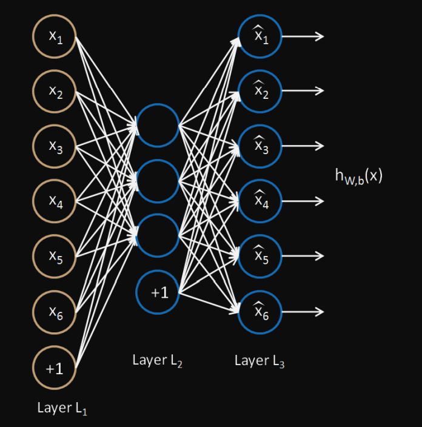

# Autoencoders

Autoencoders are a specialized class of algorithms that can learn efficient representations of 
input data with no need for labels.
It is an unsupervised learning algorithm that tries to set the target values to be equal to the inputs.

An autoencoder learns two functions: an encoding function that transforms the input data, and a decoding function that recreates the input data from the encoded representation.

The different ways to constrain the network are: –
-  If the size of each hidden layer is kept as small as possible, then the network will be forced to pick up only the representative features of the data thus encoding the data.
- Regularization encourages the network to train in ways other than copying the input.
- Another way of constraining the network is to add noise to the input and teach the network how to remove the noise from the data.
- changing the activation functions of various nodes so that a majority of the nodes are dormant thus, effectively reducing the size of the hidden layers

## Types of Autoencoders

###  Denoising Autoencoder
###  Sparse Autoencoder

###  Variational Autoencoder

###  Convolutional Autoencoder

## Implementation of Autoencoders
