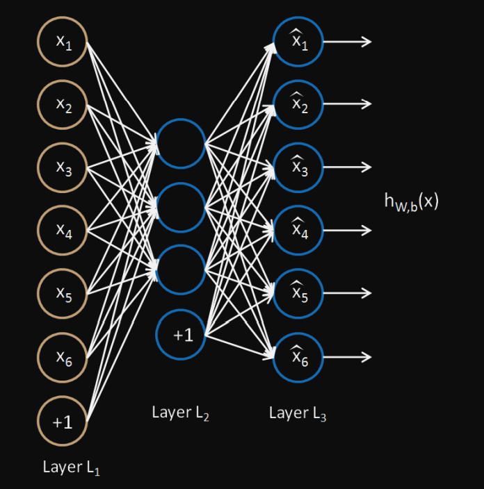

# Autoencoders

Autoencoders are a specialized class of algorithms that can learn efficient representations of 
input data with no need for labels.
It is an unsupervised learning algorithm that tries to set the target values to be equal to the inputs.

An autoencoder learns two functions: an encoding function that transforms the input data, and a decoding function that recreates the input data from the encoded representation.

The different ways to constrain the network are: –
-  If the size of each hidden layer is kept as small as possible, then the network will be forced to pick up only the representative features of the data thus encoding the data.
- Regularization encourages the network to train in ways other than copying the input.
- Another way of constraining the network is to add noise to the input and teach the network how to remove the noise from the data.
- changing the activation functions of various nodes so that a majority of the nodes are dormant thus, effectively reducing the size of the hidden layers

## Types of Autoencoders

###  Denoising Autoencoder
- works on a partially corrupted input and trains to recover the original undistorted image.
- can be used as a form of data augmentatio

###  Sparse Autoencoder
- contains more hidden units than the input but only a few are allowed to be active at once. This property is called the sparsity of the network.
- The sparsity of the network can be controlled by either manually zeroing the required hidden units, tuning the activation functions or by adding a loss term to the cost function.
- These autoencoders often learn important and meaningful features due to their emphasis on sparse activations.
- increases computational complexity.
- highly used in interpretability field of neural networks

###  Variational Autoencoder
- used to generate new data points that resemble the original training data
- uses the Stochastic Gradient Variational Bayes estimator in the training process
- useful in detecting anomalies and data exploration.

###  Convolutional Autoencoder
- use convolutional neural networks as their building blocks.
-  The decoder is the mirror image of the encoder it deconvolves the compressed representation and tries to reconstruct the original image.

## Implementation of Autoencoders
- 